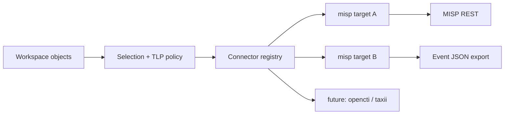

# RFC 0005: Sharing system and MISP connector

- **RFC:** 0005
- **Title:** Sharing system and MISP connector
- **Author:** Amine Besson
- **Status:** draft
- **Created:** 2026-09-15
- **Issue:** [#10](https://github.com/OpenTideHQ/specifications/issues/10)
- **PR:** [#9](https://github.com/OpenTideHQ/specifications/pull/9)

> Numbering note: [issue #8](https://github.com/OpenTideHQ/specifications/issues/8) reserved **RFC 0004** for the Sysdig Falco deployer. That RFC file is not in this repository yet. This proposal takes **0005** to avoid colliding with that reservation.

## Summary

Add a first-class **sharing** subsystem to OpenTide: a pluggable registry of sharing *targets*, workspace configuration that names those targets and their policy, and a CLI family `opentide share` that publishes Tide objects (threat, objective, rule) to external intelligence platforms. Sharing is **not** detection-platform deployment — `opentide deploy` remains the path to SIEMs and EDRs. The first connector is **MISP**, specified here in enough detail to implement without inventing API semantics later. Vocabulary files already carry optional `misp` mappings (TLP, PAP, maturity, RSIT, kill chain, sectors, criticality, viability); the connector MUST use those fields rather than hard-coding taxonomy strings.

This RFC is additive. It does not revise `threat::1.0`, `objective::1.0`, or `rule::1.0`. After acceptance, follow-up PRs add `specs/sharing.md`, `specs/sharing/misp-1.0.md`, configuration/workspace updates, and conformance fixtures. opentide implements the CLI and connector in a separate repository.

## Motivation

Detection-engineering teams already keep ATT&CK-mapped threats, objectives, and rules in an OpenTide workspace, with TLP on every object. They still copy that content into MISP by hand — or do not share it at all — because OpenTide can **deploy** a rule to Sentinel but cannot **publish** the surrounding detection knowledge to a CTI community.

Stakeholders:

- **Detection engineers** need a repeatable, TLP-aware `opentide share` that does not dump queries or tenant identifiers by accident.
- **CTI / ISAC operators** need MISP events that round-trip OpenTide identity (`metadata.uuid`), TLP/PAP tags, and ATT&CK galaxies so communities can consume detections as intelligence, not as opaque YAML.
- **Implementers (opentide)** need a connector contract analogous to [platforms.md](../specs/platforms.md): capability matrix, TOML shape, honest failure modes, idempotent upsert.
- **Vocabulary maintainers** already encode MISP taxonomy strings on `[[keys]]`; sharing is the consumer that makes those fields useful.

Without a spec, each workspace would invent its own export script, TLP handling would drift, and a later OpenCTI or TAXII connector would not share a CLI or config model.

## Detailed design

### 1. Sharing is a sibling of deployment, not a platform

| Concern | Command | Config | Destination |
|---------|---------|--------|-------------|
| Detection runtime | `opentide deploy` | `deployment.toml`, `platforms/*.toml` | SIEM / EDR |
| Intelligence publication | `opentide share` | `sharing.toml`, `sharing/targets/*.toml` | CTI platforms (MISP first) |

MISP MUST NOT be added to the [platforms](../specs/platforms.md) capability matrix. A MISP instance is not a query engine and MUST NOT grow a `configurations.misp` block on `rule::1.0`.

Connectors register by **connector id** (`misp`). A workspace MAY define **multiple targets** of the same connector (for example `misp-internal` and `misp-isac`), each with its own URL, sharing group, and TLP ceiling.



### 2. Spec files after acceptance

| Path | Action | `schema_id` |
|------|--------|-------------|
| `specs/sharing.md` | **New** — sharing system (CLI, selection, policy, target registry, state) | — |
| `specs/sharing/misp-1.0.md` | **New** — MISP connector | `sharing::misp::1.0` |
| `specs/configuration.md` | Add `sharing.toml` and `sharing/targets/` to the overridable file table; merge rules | bump spec `version` (additive) |
| `specs/workspace.md` | Document `.opentide/configurations/sharing/`, `.opentide/sharing/` state, export paths | bump spec `version` (additive) |
| `SPECS.md` / `CHANGELOG.md` | Index the new specs | — |
| `fixtures/valid/sharing-*` | Target TOML + golden MISP Event JSON | — |
| `fixtures/invalid/sharing-*` | Policy violations (TLP ceiling, missing API key placeholder, bad distribution) | — |
| Object specs / vocabularies | **No structural change.** Document that `[[keys]].misp` is consumed by sharing. | — |

No new object schema revision. `metadata.schema` values stay `threat::1.0` / `objective::1.0` / `rule::1.0`.

Optional later (out of this RFC’s MUST set): `metadata.pap` on [metadata.md](../specs/metadata.md). Until that exists, PAP tags MAY be applied from target config defaults only.

### 3. Configuration

#### 3.1 Merge and discovery

Sharing configuration follows the existing [configuration](../specs/configuration.md) merge order: bundled package → client `.opentide/configurations/` → parent instance. Vocabulary files remain non-overridable.

| File | May override? | Purpose |
|------|---------------|---------|
| `sharing.toml` | Yes | Global sharing policy, default targets, selection |
| `sharing/targets/<id>.toml` | Yes | Per-target connection, connector, policy overlays |
| Secrets in TOML | Yes, but values MUST support `${ENV_VAR}` substitution (same pattern as `deployment.toml` proxy passwords) | API keys, optional client cert paths |

Top-level `sharing.toml` maps to config key `sharing`. Each file under `sharing/targets/` becomes `sharing.targets.<stem>` keyed by `[target].identifier` if set, else the filename stem.

Bundled defaults MUST ship with sharing **disabled** (`enabled = false` on `[sharing]` and on every bundled target), matching platforms.

#### 3.2 `sharing.toml`

```toml
[sharing]
enabled = false
require_validation = true
default_targets = []          # empty = all enabled targets
max_tlp = "amber"             # vocabulary `tlp` name; ceiling for every target unless a target sets a stricter value
allow_tlp_red = false
include_internal_references = false
include_queries = false
include_platform_blocks = false
include_tenant_identifiers = false

[sharing.selection]
object_types = ["threat", "objective", "rule"]
# Rules only: deployment statuses eligible to share. Threats/objectives have no status.
rule_statuses = ["PRODUCTION"]
```

| Field | Type | Required | Default | Semantics |
|-------|------|----------|---------|-----------|
| `enabled` | bool | no | `false` | Master switch. `opentide share` MUST refuse to push when false (preview/status MAY still run). |
| `require_validation` | bool | no | `true` | When true, push MUST run the default [validation](../specs/validation.md) checks on in-scope objects and MUST NOT share objects that raise errors. Warnings do not block. |
| `default_targets` | list[string] | no | `[]` | Target identifiers used when `--target` is omitted. Empty list means every target with `enabled = true`. |
| `max_tlp` | string | no | `amber` | MUST be a `tlp` vocabulary `name`. Objects whose `metadata.tlp` exceeds this ceiling are `skipped_tlp` in the share report (not a silent omit, and not exit `1`). TLP order for comparison: `clear` < `green` < `amber` < `amber+strict` < `red`. |
| `allow_tlp_red` | bool | no | `false` | Even if `max_tlp = "red"`, TLP:RED MUST NOT be shared unless this is true **and** the operator passes `--allow-tlp-red`. |
| `include_internal_references` | bool | no | `false` | When false, `references.internal` MUST NOT be emitted. |
| `include_queries` | bool | no | `false` | When false, platform query/search/condition/sigma/yara bodies MUST NOT be emitted. |
| `include_platform_blocks` | bool | no | `false` | When false, connector emits rule metadata + ATT&CK + response narrative only — not per-platform configuration structure. |
| `include_tenant_identifiers` | bool | no | `false` | When false, `tenants` (and any tenant-like identifiers) MUST NOT be emitted. |
| `selection.object_types` | list[string] | no | all three families | Restrict families. |
| `selection.rule_statuses` | list[string] | no | `["PRODUCTION"]` | MUST match names from merged `deployment.toml`. Threats and objectives ignore this key. |

Target-level policy overlays MUST be **at least as strict** as the global ceiling: a target MAY lower `max_tlp` or force `include_queries = false`; a target MUST NOT raise `max_tlp` above the global value or enable `include_queries` when the global flag is false. CLI flags follow the same “strictest wins” rule except `--allow-tlp-red`, which is an explicit operator override gated by `allow_tlp_red`.

#### 3.3 Target file (`sharing/targets/<id>.toml`)

Every target file MUST contain `[target]` with a known `connector`. Additional tables are connector-specific; unknown tables MUST be ignored with a warning, not a hard fail, so future connectors can ship keys before an older CLI learns them — except `connector` itself, which MUST be recognized or the target is skipped with an error.

Common `[target]` fields:

| Field | Type | Required | Default | Description |
|-------|------|----------|---------|-------------|
| `enabled` | bool | no | `false` | Participate in share runs |
| `identifier` | string | no | filename stem | Stable id used by `--target` |
| `name` | string | no | identifier | Display name |
| `connector` | string | **yes** | — | Connector id (`misp` for this RFC) |
| `schema` | string | **yes** for MISP | — | Connector schema id, e.g. `sharing::misp::1.0` |
| `description` | string | no | `""` | Human notes |

### 4. CLI: `opentide share`

Normative command family. Implementations MUST provide these subcommands; `opentide share` with no subcommand MUST mean `push`.

| Command | Purpose |
|---------|---------|
| `opentide share` / `opentide share push` | Publish in-scope objects to selected targets |
| `opentide share preview` | Build payloads, apply policy, write nothing to the remote (equivalent to `push --dry-run`) |
| `opentide share status` | Show local share state vs object versions (no remote mutation) |
| `opentide share retract` | Unpublish (default) or delete (`--delete`) remote records for in-scope objects |
| `opentide share targets` | List configured targets, connector, enabled flag, and redacted connection (URL yes, API key never) |

Shared flags (push / preview / retract):

| Flag | Effect |
|------|--------|
| `--target <id>` | Repeatable. Restrict to named targets. Unknown id is an error. |
| `--uuid <uuid>` | Repeatable. Narrow to objects. |
| `--type <family>` | Repeatable. `threat`, `objective`, `rule`. |
| `--file <path>` | Repeatable. Narrow to YAML files. |
| `--dry-run` | On `push`: same as `preview`. |
| `--allow-tlp-red` | Required in addition to `allow_tlp_red = true` to share TLP:RED. |
| `--publish` / `--no-publish` | Override target `publish` for this run (MISP: whether to call publish after upsert). |
| `--include-queries` | MAY enable query emission **only if** global and target config already allow it. MUST NOT punch through a configured `include_queries = false`. |
| `--workers` | Optional parallelism across **HTTP** upserts; default implementation-defined. MUST NOT skip the share plan in §7.4 (presence is computed before workers start). |

Scope rules MUST match [validation](../specs/validation.md): `--file` / `--uuid` / `--type` that match nothing MUST fail with `scope_no_match` rather than succeeding vacuously.

Exit status (whole command, not per target; object-level outcomes live in the share report). Implementations MUST choose **exactly one** code using this order:

1. Preflight (validation, policy misconfiguration, `sharing_group_unresolved` before any Event is written, file-mode `sharing-group` with `sharing_group_id = 0`, `scope_no_match`) → `1`.
2. Else if at least one object action succeeded (`created` / `updated` / `unchanged` / `retracted`) **and** at least one object or target `failed` → `3`.
3. Else if no object `failed` → `0`. Policy skips (`skipped_tlp`, `skipped_status`) are not `failed`. An all-skip run is `0`.
4. Else (at least one `failed`, no successful object action): if every `failed` is authentication or connectivity → `2`; otherwise → `1`.

| Code | Meaning |
|------|---------|
| `0` | Preflight passed and no object `failed`. Policy skips are reported and do not fail the run. |
| `1` | Preflight error, **or** total failure that is not solely auth/connectivity (every object `failed` with `org_mismatch`, HTTP 5xx, `sharing_group_unresolved` on the sole target, and similar). |
| `2` | No successful object action, and every `failed` is authentication or connectivity. If any object succeeded while another had auth failure, use `3` (step 2). |
| `3` | Partial success: at least one successful object action **and** at least one `failed` object or target. Includes mixed objects on **one** target (parent `failed` after children were sent) and mixed targets. |

This order is a partition: a sole-target run of only `org_mismatch` / HTTP 5xx is `1`; only auth/connectivity is `2`; mixed success and failure is `3`; policy skips with no `failed` remain `0`.

Stdout SHOULD be a structured share report (human table by default; `--json` MAY be offered). The report MUST include, per object per target: action (`created`, `updated`, `unchanged`, `skipped_tlp`, `skipped_status`, `retracted`, `failed`), remote identifier, and reason on skip/fail.

Secrets MUST NOT appear in logs, reports, or preview payloads (redact API keys, Authorization headers, and substituted secret values).

### 5. Workspace layout and share state

Additions to [workspace.md](../specs/workspace.md):

| Path | Purpose | Client-edited? |
|------|---------|----------------|
| `.opentide/configurations/sharing.toml` | Global sharing overrides | Yes |
| `.opentide/configurations/sharing/targets/` | Per-target TOML | Yes |
| `.opentide/sharing/state.json` | Last successful share mapping | **No** — generated |
| `.opentide/exports/sharing/` | Preview / `mode = "file"` Event JSON | **No** — generated |

`state.json` is an implementation artifact, not a Tide object. Suggested shape (informative for opentide; the spec SHOULD require the listed fields, not the filename of a Pydantic model):

| Field | Description |
|-------|-------------|
| `object_uuid` | Tide `metadata.uuid` |
| `object_schema` | `metadata.schema` |
| `object_version` | `metadata.version` at last successful share |
| `content_hash` | Hash of the **emitted** payload (post-redaction), not the raw YAML |
| `target_id` | Sharing target identifier |
| `connector` | `misp` |
| `remote_event_uuid` | MISP Event UUID |
| `remote_event_id` | MISP numeric id if known |
| `published` | Whether the event was published |
| `shared_at` | ISO-8601 timestamp |

Idempotency: push MUST look up the remote event by UUID (see §7.4). If the stored `content_hash` matches the payload that would be sent, the action is `unchanged`. State MUST NOT be treated as authoritative if the remote lookup disagrees (remote wins; state is repaired). A `state.json` `remote_event_uuid` MUST NOT by itself make a parent Event **present** for `extends_uuid` (§7.4).

Generated sharing paths MUST NOT be committed as hand-edited sources (same rule as `.opentide/exports/`). Implementations SHOULD gitignore `state.json`.

### 6. Connector registry (generic)

A connector implementation MUST declare:

| Capability | MISP 1.0 |
|------------|----------|
| `identifier` | `misp` |
| `schema` | `sharing::misp::1.0` |
| `push` | yes |
| `preview` | yes (payload without HTTP mutation) |
| `status` | yes (local state; MAY optionally HEAD/view remote) |
| `retract` | yes (unpublish; optional delete) |
| `pull` | **no** (inbound MISP → OpenTide is out of scope) |

Connectors without `pull` MUST NOT advertise import. Future connectors (OpenCTI, TAXII 2.1 collections) get their own `sharing::<id>::1.0` specs; this RFC does not specify them.

### 7. MISP connector (`sharing::misp::1.0`)

#### 7.1 Target TOML

```toml
[target]
enabled = false
identifier = "misp"
name = "MISP"
connector = "misp"
schema = "sharing::misp::1.0"
description = "Community MISP"

[connection]
url = "https://misp.example.org"
api_key = "${MISP_API_KEY}"
verify_ssl = true
timeout_seconds = 30
# optional client TLS
# client_cert = "${MISP_CLIENT_CERT}"
# client_key = "${MISP_CLIENT_KEY}"

[misp]
mode = "api"                 # api | file
publish = false              # call /events/publish after upsert
distribution = "this-community"  # clamped to the TLP allowed set (§7.1); amber without a sharing group → 0
sharing_group_id = 0         # required for distribution 4 in file mode; API fallback if UUID empty
sharing_group_uuid = ""      # preferred in api mode; resolved via GET /sharing_groups (not in file mode)
event_mode = "per-object"    # per-object | bundle
threat_level_source = "family"  # family | criticality | severity | alert_severity | undefined
analysis = "completed"       # initial | ongoing | completed
tag_namespace = "opentide"
attach_attack_galaxy = true
attach_actor_galaxy = true
include_object_yaml = false  # attach a *redacted* YAML copy; never raw on-disk YAML (see §7.6)
verify_event_org = true      # refuse to edit an existing UUID owned by another org

[misp.tags]
# Extra constant tags applied to every event from this target
extra = []

[misp.file]
# used when mode = "file"
directory = ".opentide/exports/sharing/misp"
```

**`[connection]`**

| Field | Type | Required | Default | Notes |
|-------|------|----------|---------|-------|
| `url` | string (URL) | **yes** when `mode = "api"` | — | Origin only (scheme + host + optional port/path prefix). Trailing slash ignored. |
| `api_key` | string | **yes** when `mode = "api"` | — | MUST be provided via env substitution in committed config. Literal keys in git SHOULD be rejected by validation with a warning; MUST NOT be printed. |
| `verify_ssl` | bool | no | `true` | |
| `timeout_seconds` | number | no | `30` | Per-request timeout |
| `client_cert` / `client_key` | string | no | — | Mutual TLS |

**`[misp]` distribution enum** (config strings → MISP integer):

| Config value | MISP `distribution` | When to use |
|--------------|---------------------|-------------|
| `your-organization` | `0` | Org-only; the only allowed value for `amber+strict` and `red` |
| `this-community` | `1` | Typical `green` community instance |
| `connected-communities` | `2` | Wider sync mesh; `clear` / `green` only |
| `all-communities` | `3` | `clear` only |
| `sharing-group` | `4` | Named channel (not a point on the 0–3 width scale). Requires a sharing-group identifier; **how** is mode-specific (table below) |

If `distribution = "sharing-group"`, fail that target **before** any event is written when the mode-specific identifier rule is not met:

- `api`: neither `sharing_group_uuid` nor a non-zero `sharing_group_id` is set.
- `file`: `sharing_group_id` is 0 (a UUID alone is not enough; see the `file` row below).

Sharing-group identifier resolution depends on `mode` (MISP Event JSON uses numeric `sharing_group_id` when `distribution` is 4):

| Mode | Rule |
|------|------|
| `api` | `sharing_group_uuid` is preferred. When it is set, implementations MUST resolve it via `GET /sharing_groups` on each run (UUID wins if both are set). If the UUID is empty, use non-zero `sharing_group_id`. If the UUID is set and not found, fail the target (`sharing_group_unresolved`). |
| `file` | MUST NOT call `/sharing_groups` (`url` / `api_key` are not required). A non-zero `sharing_group_id` is **required** so the Event JSON can set MISP's numeric `sharing_group_id`. UUID-only file config (`sharing_group_id = 0`) MUST fail before any file is written (`sharing_group_id required in file mode`). The UUID MAY be copied into export metadata; it MUST NOT be treated as resolved. |

**TLP → allowed distributions.** MISP `sharing-group` (4) is a membership list, not a width between 0 and 3, so resolution is a **set membership** check rather than `min()` on integers. For each object, compute the allowed set from `metadata.tlp`. If `[misp].distribution` is omitted, use the default in that row. If it is set and **in** the allowed set, use it. If it is set and **not** in the allowed set, use the row default (do not fail the object solely for this clamp).

| Object `metadata.tlp` | Allowed `[misp].distribution` values | Default (config omitted) |
|-----------------------|--------------------------------------|--------------------------|
| `clear` | `your-organization`, `this-community`, `connected-communities`, `all-communities`, `sharing-group` | `all-communities` (3) |
| `green` | `your-organization`, `this-community`, `connected-communities`, `sharing-group` | `this-community` (1) |
| `amber` | `your-organization`, `sharing-group` | `sharing-group` (4) if a group is configured, else `your-organization` (0) |
| `amber+strict` | `your-organization` | `your-organization` (0) |
| `red` | `your-organization` | not shared unless `--allow-tlp-red`; then `your-organization` (0) |

Examples: target `distribution = "this-community"` with TLP `amber` clamps to `your-organization` (1 is not allowed for amber). Target `distribution = "all-communities"` with TLP `green` clamps to `this-community`. Target `distribution = "sharing-group"` with TLP `amber+strict` clamps to `your-organization`.

**`event_mode`**

| Mode | Remote record | Idempotency key |
|------|---------------|-----------------|
| `per-object` (default) | One MISP Event per Tide object | Event `uuid` = Tide `metadata.uuid` |
| `bundle` | One Event per connected subgraph (threat + referencing objectives + implementing rules) that intersects the selection | Event `uuid` = UUID v5 of sorted root threat UUID(s) in URL namespace `https://opentide.dev/sharing/misp/bundle` (normative algorithm MUST be specified in the spec so two implementations agree) |

v1 implementations MUST support `per-object`. `bundle` MAY ship in the same version; if unimplemented, setting `event_mode = "bundle"` MUST error clearly rather than silently fall back.

**`mode = "file"`** writes one JSON document per event under `[misp.file].directory` (created if missing). Filenames SHOULD be `<event-uuid>.json`. File mode MUST still apply TLP/query redaction. It MUST NOT require `url` or `api_key` and MUST NOT perform HTTP (including sharing-group UUID lookup). For `distribution = "sharing-group"`, see the file-mode row in the identifier table above.

#### 7.2 HTTP API (normative subset)

Minimum MISP version: **2.4.80** (objects). Implementations SHOULD document 2.5 as the tested line.

Auth: every request MUST send the API key as MISP expects (`Authorization: <key>`). Implementations MUST NOT put the key in query strings.

| Operation | Method / path | Use |
|-----------|---------------|-----|
| Server identity | `GET /servers/getVersion` (or equivalent user/me) | Connectivity probe before push |
| View event by UUID | `GET /events/view/<uuid>` | Idempotent lookup |
| Add event | `POST /events/add` | Create, including nested objects/tags when the payload contains them |
| Edit event | `POST /events/edit/<id>` | Update after lookup |
| Publish | `POST /events/publish/<id>` | When `publish = true` |
| Unpublish | `POST /events/unpublish/<id>` | Retract default |
| Delete event | `DELETE /events/<id>` | Retract `--delete` |
| Add object | `POST /objects/add/<event_id>` | When objects are added after event create |
| Attach galaxy cluster | MISP galaxy attach API used by PyMISP `attach_galaxy_cluster` / tag-as-galaxy | ATT&CK + actors |
| List sharing groups | `GET /sharing_groups` | Resolve UUID → numeric id (`mode = api` only) |

PyMISP is the **recommended** opentide implementation library; the spec is HTTP/JSON, not Python. Any client that speaks this subset conforms.

On `401`/`403`, the target MUST fail with “authentication failed” without dumping response bodies that might include keys. On `404` during edit of a UUID we expected to exist, push MAY recreate. If `verify_event_org` is true and the existing event’s `Orgc.uuid` / `Org.uuid` does not match the authenticated user’s organisation, push MUST fail for that object (`failed`, reason `org_mismatch`) and MUST NOT edit.

#### 7.3 Taxonomy and galaxy mapping

Connectors MUST resolve vocabulary `misp` fields from canonical `vocabularies/*.vocab.toml` ([format.md](../specs/vocabularies/format.md) already defines `[[keys]].misp`).

| OpenTide source | MISP emission |
|-----------------|---------------|
| `metadata.tlp` | Event tag = that key’s `misp` value (`tlp:clear`, `tlp:green`, `tlp:amber`, `tlp:amber+strict`, `tlp:red`) |
| Target default PAP (optional config) | Event tag `PAP:WHITE` / `PAP:GREEN` / `PAP:AMBER` / `PAP:RED` |
| `criticality` / `severity` / `alert_severity` | Event `threat_level_id` per §7.4 (family-default source); plus taxonomy tags when the source key has a `misp` field |
| `maturity` | Tag `DML:n` when sharing a rule that carries maturity (if the object has no maturity field, skip) |
| `killchain` | Tags from `killchain.vocab.toml` `misp` strings |
| `threat.actors[]` | If `attach_actor_galaxy`: each `ThreatActor.name` is a scoped `actors::1.0` value (`att&ck::<id>` or `misp::<id>` — [specifications#11](https://github.com/OpenTideHQ/specifications/issues/11)). `att&ck::` attaches the MITRE ATT&CK *group* galaxy cluster for `<id>`; `misp::` attaches the MISP threat-actor galaxy cluster for `<id>`. Bare strings and unscoped ids MUST NOT be coerced. Optional `sighting` / `references` become Event attributes (`text` / `link`, comments `actor-sighting` / `actor-reference`, correlation off) |
| `threat.att&ck` / objective `attack` / rule `techniques` | If `attach_attack_galaxy`: MITRE ATT&CK galaxy clusters for each technique id (and parent technique when a sub-technique is used) |
| RSIT / sectors | Emit tags only when those fields exist on the object (threat sector etc. as specs evolve) |

**OpenTide bookkeeping tags** (using `tag_namespace`, default `opentide`):

| Tag | Required? | Example |
|-----|-----------|---------|
| `<ns>:family` | always | `opentide:family="rule"` |
| `<ns>:schema` | always | `opentide:schema="rule::1.0"` |
| `<ns>:version` | always | `opentide:version="1"` |
| `<ns>:uuid` | optional (useful in `bundle` mode; omit in `per-object` when Event `uuid` already is the Tide UUID) | `opentide:uuid="<uuid>"` |
| `<ns>:status` | rules only, always | `opentide:status="PRODUCTION"` |

#### 7.4 Event envelope (every family, `per-object` mode)

| MISP Event field | Source |
|------------------|--------|
| `uuid` | Tide `metadata.uuid` |
| `info` | Object `name` (MUST be non-empty; already required on all three families) |
| `date` | Date portion of `metadata.created` (YYYY-MM-DD) |
| `timestamp` | From `metadata.modified` when parseable; else omitted (server sets) |
| `distribution` | §7.1 TLP-narrowed value |
| `sharing_group_id` | When distribution is 4 |
| `threat_level_id` | See table below |
| `analysis` | `[misp].analysis` mapping: `initial→0`, `ongoing→1`, `completed→2` |
| `published` | false on add; MISP `/events/publish` is a separate call and is **not** the parent-link gate |
| `extends_uuid` | See **Parent Event link** below. MUST NOT depend on MISP `published`. |

**Parent Event link (`extends_uuid`).** In `per-object` mode, a rule Event MAY set `extends_uuid` to `detection_model` (objective UUID). An objective Event MAY set `extends_uuid` to the first UUID in `objective.threats[]` whose Event is **present**. Related-event links use the same presence test.

**Share plan (before any upsert).** For each selected target, implementations MUST compute a plan over the **full** share selection before emitting Events or starting `--workers`. For each object the plan is `emit` (a payload will be produced: later report `created` / `updated` / `unchanged`) or `skip` (`skipped_tlp` / `skipped_status`). The plan MUST be local (policy + selection only) and MUST NOT depend on HTTP completion order.

The parent Event is **present** for this target only as follows (evaluate in order; do not OR stale state with a this-run skip):

1. **Parent is in this run’s selection.** If the plan is `skip`, the parent is **not** present (this-run policy wins, even if `state.json` still has a UUID). If the plan is `emit`, the parent **is** present — including when that parent’s HTTP has not run yet, and including `preview`, `push --dry-run`, and `mode = file`.
2. **Parent is not in this run’s selection.**
   - `mode = api`: present only if `GET /events/view/<parent-uuid>` succeeds. `state.json` is a hint, not authority. HTTP `404` → not present; drop or repair the state row. A successful view wins even if `state.json` `published` is false.
   - `mode = file` (and any preview that does not contact the server): **not** present. Stale export state MUST NOT imply a remote Event.

MUST omit `extends_uuid` when the parent Event is not present (no dangling MISP extends). MISP Event `published`, `/events/publish`, `[misp].publish`, and `state.json` `published` MUST NOT be this gate (`publish` defaults to false; preview never publishes). Unpublished Events still exist and MAY be extended.

`--workers` MAY parallelize upserts but MUST use the same plan for every object. Implementations SHOULD still upsert in topological order (threat → objective → rule) so a parent that `failed` after the plan said `emit` can omit `extends_uuid` on children not yet sent. Children already sent with a now-dangling extend are mixed object outcomes on that target: exit `3` (CLI table). Retry repairs them.

**`threat_level_id`** (MISP: 1 High, 2 Medium, 3 Low, 4 Undefined).

`[misp].threat_level_source` selects which Tide field is mapped. The default `family` picks a field that **exists on that object family** — do not use a single global `criticality` source (rules and objectives have no `criticality`).

| `threat_level_source` | Threat | Objective | Rule |
|-----------------------|--------|-----------|------|
| `family` (default) | top-level `criticality` | `objective.priority` | top-level `severity`; if absent, `response.alert_severity` |
| `criticality` | `criticality` | none → `4` | none → `4` |
| `severity` | `threat.severity` | highest `signals[].severity` | top-level `severity` |
| `alert_severity` | none → `4` | none → `4` | `response.alert_severity` |
| `undefined` | always `4` | always `4` | always `4` |

Match the selected field’s value to the **exact vocabulary `name`** (case-sensitive first; if no hit, case-insensitive equality). Do not substring-match (`minor` must not match `Baseline - Minor` via a token list of `minor` alone — use the full name).

**`criticality` vocabulary → `threat_level_id`**

| `criticality` name | `threat_level_id` |
|--------------------|-------------------|
| `Emergency` | `1` |
| `Severe` | `1` |
| `High` | `1` |
| `Medium` | `2` |
| `Low` | `3` |
| `Baseline - Minor` | `3` |
| `Baseline - Negligible` | `3` |
| anything else / missing | `4` |

**MDR / alert-style names** (rule `severity` as used in fixtures, `response.alert_severity`, `objective.priority` when it uses the same tokens) **→ `threat_level_id`**

| Name | `threat_level_id` |
|------|-------------------|
| `Critical` | `1` |
| `High` | `1` |
| `Medium` | `2` |
| `Low` | `3` |
| `Informational` | `3` |
| anything else / missing | `4` |

**Threat `severity` vocabulary** (NCSC incident categories on `threat.severity` only, when that field is the selected source) **→ `threat_level_id`**

| `severity` name | `threat_level_id` |
|-----------------|-------------------|
| `National cyber emergency` | `1` |
| `Highly significant incident` | `1` |
| `Significant incident` | `1` |
| `Substantial incident` | `2` |
| `Moderate incident` | `3` |
| `Localised incident` | `3` |
| anything else / missing | `4` |

The §7.8 rule example uses `severity: High` on a **rule**, so with `family` source it maps through the MDR table to `threat_level_id` `1` — not through `criticality`.

#### 7.5 Object-family mapping

##### Threat (`threat::1.0`) → Event + attributes + galaxies

No stock MISP object captures TVM fields (`terrain`, `surface`, `leverage`, `viability`, chaining). v1 MUST emit **typed attributes** on the Event (not a required custom template). A follow-up MAY contribute `opentide-threat` to [MISP/misp-objects](https://github.com/MISP/misp-objects).

Field types follow `threat::1.0` as corrected in [specifications#11](https://github.com/OpenTideHQ/specifications/issues/11) / [#12](https://github.com/OpenTideHQ/specifications/issues/12): `impact` and `leverage` are non-empty `list[string]`; `actors` is `list[ThreatActor]`. Semicolon-packed strings and bare actor string lists MUST NOT be split or coerced here — invalid objects fail `require_validation` instead.

| Tide field | MISP | `disable_correlation` |
|------------|------|------------------------|
| `name` | Event `info` | n/a |
| `threat.description` | Attribute `comment` or `text` category Other, comment `description` | yes |
| `threat.terrain` | Attribute `text`, comment `terrain` | yes |
| `threat.surface[]` | Attribute `text` (one per value), comment `surface` | yes |
| `criticality` | Attribute `text` + taxonomy tag via `misp` | yes |
| `threat.severity` | Attribute `text` + optional tag | yes |
| `threat.impact[]` | Attribute `text` (**one per list value**), comment `impact` | yes |
| `threat.leverage[]` | Attribute `text` (**one per list value**), comment `leverage` | yes |
| `threat.viability` | Attribute `text` + `misp` tag when present | yes |
| `threat.killchain` | Tags from vocabulary | n/a |
| `threat.att&ck[]` | ATT&CK galaxy | n/a |
| `threat.actors[].name` | Actor galaxy from the scoped token (see §7.3); no string-list form | n/a |
| `threat.actors[].sighting` | Attribute `text`, comment `actor-sighting` | yes |
| `threat.actors[].references[]` | Attribute `link`, comment `actor-reference` | no |
| `threat.chaining[]` | Attribute `text` JSON or `comment` per relation; correlation off | yes |
| `references.public` | Attribute `link` | no |
| `references.reports[]` | Attribute `link` | no |
| `references.internal` | omitted unless `include_internal_references` | — |
| `metadata.author` / `organisation.name` | Attribute `text` comments `author` / `organisation` | yes |

Chaining targets SHOULD be expressed as MISP **related events** when the chained threat Event is **present** (§7.4), using the chained UUID. MUST NOT emit a related-event link when that threat is not present.

##### Objective (`objective::1.0`) → MISP object `detection` (partial) + Event

Map to the stock [`detection`](https://github.com/MISP/misp-objects/blob/main/objects/detection/definition.json) template where fields exist. Required template attributes that OpenTide cannot fill MUST be given deterministic placeholders so the object validates:

| `detection` attribute | Required by template? | Tide source |
|-----------------------|-----------------------|-------------|
| `analytic-title` | yes | `name` |
| `id` | yes | `metadata.uuid` |
| `status` | yes | Exact MISP `values_list` token: `Experimental`, `Test`, `Production`, or `Deprecated` (case-sensitive). **v1 decision:** always `Experimental` for objectives (no graph walk). Deriving `Test`/`Production` from implementing rules is a later revision. |
| `hypothesis` | yes | `objective.description` |
| `description` | no | `objective.description` (duplicate is acceptable) |
| `version` | no | `metadata.version` as string |
| `author` | no | `metadata.author` |
| `date-created` / `date-modified` | no | metadata dates |
| `mitre-attack-technique` | no | `objective.attack[]` |
| `data-source` | no | Unique `signals[].data.logsources[]` tokens when present (MITRE data-source refs). One MISP attribute per token. `signals[].data` is a `SignalData` object (`availability`, `requirements`, optional `logsources`) — MUST NOT stringify or concatenate the mapping. |
| `data-event` | no | omitted in v1 (no Tide field maps to it) |
| `investigation-steps` | no | omitted at objective level |

Signals: one `text` attribute per signal, comment `signal:<uuid>`, value `name — description`, correlation disabled. Signal example queries MUST NOT be emitted unless `include_queries` is true.

`objective.threats[]` → Event `extends_uuid` (first threat whose Event is **present**, §7.4) plus related-event links for each threat UUID whose Event is present. MUST NOT set `extends_uuid` or a related-event link to a threat that is not present.

##### Rule (`rule::1.0`) → MISP object `detection`

Best-fit stock object. Template required fields:

| `detection` attribute | Tide source |
|-----------------------|-------------|
| `analytic-title` | `name` |
| `id` | `metadata.uuid` |
| `status` | map top-level rule `status` (bundled names or overridden `deployment.toml` **strategy**) — see below |
| `hypothesis` | `description` (rules have no separate hypothesis field) |
| `description` | `description` |
| `version` | `metadata.version` |
| `author` | `metadata.author` |
| `date-created` / `date-modified` | metadata dates |
| `mitre-attack-technique` | `techniques[]` |
| `alert-severity-default` | `response.alert_severity` mapped into template enum `{Low, Medium, High, Critical}`: Informational→Low, Low→Low, Medium→Medium, High→High, Critical→Critical; other values omitted |
| `investigation-steps` | `response.procedure.analysis` |
| `response-remediation-steps` | `response.procedure.containment` |
| `triage-steps` | omitted unless later spec adds one |
| `detection-logic` | **only if** `include_queries` — see query policy |
| `data-source` | enabled configuration **keys** (`sentinel`, `splunk`, …). This is the OpenTide platform identifier, which matches the MISP attribute’s “EDR / Sysmon / Zeek” examples better than `data-platform` (that attribute is OS/architecture: Windows, Linux, Network). Omit `data-platform` in v1 unless a later spec adds an OS/surface on the rule. Emitting the key name is metadata, not a platform block: it is allowed even when `include_platform_blocks` is false. Queries, tenants, and config structure stay redacted. |

**Rule status → `detection.status`**

Emitted values MUST be the exact MISP object `values_list` strings (`Experimental`, `Test`, `Production`, `Deprecated`). Implementations MUST NOT emit lowercase variants.

| OpenTide deployment status (bundled names) | MISP `detection.status` |
|--------------------------------------------|-------------------------|
| `DESIGN`, `DEVELOPMENT` | `Experimental` |
| `IMPROVING`, `STAGING`, `ACCEPTANCE` | `Test` |
| `PRODUCTION` | `Production` |
| `DISABLED`, `REMOVED` | `Deprecated` |
| unknown client status | `Experimental` |

Workspaces that override `deployment.toml` SHOULD still hit this table by **strategy**: `INERT`→`Experimental`, `PREVIEW`→`Test`, `RELEASE`→`Production`, `DISABLEMENT`/`DELETION`→`Deprecated`.

**Queries (`include_queries = true` only)**

| Platform block | MISP emission |
|----------------|---------------|
| `harfanglab.sigma` / any future sigma field | Additional MISP object `sigma` if the template is available; else `detection-logic` |
| `harfanglab.yara` | MISP object `yara` |
| Other query languages (KQL, SPL, S1QL, FQL, Lucene) | Attribute `text` (comment `query:<platform>`), **not** typed as IDS signature, `to_ids = false`, correlation disabled |

If `include_queries` is false, `detection-logic` is omitted (allowed: not in the template’s `required` list). `include_platform_blocks` does not imply queries.

`detection_model` (objective UUID) → `extends_uuid` + related event **only when** that objective Event is **present** (§7.4). MUST omit `extends_uuid` otherwise.

`response.playbook` / `response.responders` → attributes `text`, comments `playbook` / `responders`.

#### 7.6 Query and sensitive-field policy (MUST)

The following MUST NOT be shared regardless of flags:

- API keys, passwords, proxy credentials, client certificates
- Contents of `.opentide/configurations/` other than non-secret target display metadata
- Platform `tenants` when `include_tenant_identifiers` is false (default)
- `references.internal` when `include_internal_references` is false (default)

The following MUST NOT be shared when `include_queries` is false (default):

- Any `query`, `search`, `condition`, `sigma`, `yara`, `details` hunt strings, and `response.procedure.searches[].query`

TLP:RED payloads MUST NOT include queries even if `include_queries` is true.

Preview output MUST use the same redaction as push.

**`include_object_yaml`.** When true, the connector MAY attach a YAML **copy of the mapped object after the redaction in this section** (for example a MISP `attachment` or `text` attribute with comment `opentide-yaml`). It MUST NOT attach the on-disk source file unmodified. The copy MUST omit every field that this policy forbids for the current flags and TLP (queries, `references.internal`, `tenants`, secrets). `include_object_yaml = true` MUST NOT override `include_queries`, `include_internal_references`, or `include_tenant_identifiers`. For TLP:RED, YAML attachment is MUST NOT (even redacted), so detection logic cannot leak via a full-document dump. If redaction cannot be applied reliably (unknown nested query keys), omit the attachment and record `skipped_yaml` on the share report.

#### 7.7 Retract

| Retract mode | MISP action |
|--------------|-------------|
| default | `unpublish` if published; leave event in place |
| `--delete` | delete event (destructive). Implementations SHOULD require `--yes` or equivalent non-interactive confirm flag in CI. MUST drop the object’s `state.json` row (or clear `remote_event_uuid`) so a later child share cannot treat the deleted Event as **present**. |

Retract is still TLP-scoped: it operates on previously shared records in state/remote, not on objects that were never pushed. Default unpublish **leaves** the Event in place; that Event remains present for `extends_uuid` via `GET /events/view` (step 2 in §7.4).

#### 7.8 Example — rule authoring vs emitted Event (preview)

Author YAML (fixture-style):

```yaml
name: Sentinel KQL Rule
metadata:
  uuid: 00000000-0000-4000-8003-000000000001
  schema: rule::1.0
  version: 1
  created: "2026-01-01"
  modified: "2026-01-02"
  tlp: amber
  author: detection-team
description: Detects credential access via suspicious process creation
status: PRODUCTION
severity: High
techniques: [T1059]
detection_model: 00000000-0000-4000-8002-000000000001
response:
  alert_severity: High
  procedure:
    analysis: Confirm parent/child process chain and account context.
    containment: Isolate host if confirmed malicious.
configurations:
  sentinel:
    enabled: true
    query: |
      SecurityEvent
      | where EventID == 4688
```

Emitted MISP Event JSON (informative, `include_queries = false`). `distribution` is `0` because TLP `amber`’s allowed set is `{your-organization, sharing-group}` and no sharing group is configured, so target `this-community` clamps to `your-organization`. `threat_level_id` is `1` because `threat_level_source = family` reads the **rule** `severity: High` (MDR table), not `criticality`. `extends_uuid` is **omitted**: the linked objective Event is not **present** (not in this example’s share selection; no prior state).

```json
{
  "Event": {
    "uuid": "00000000-0000-4000-8003-000000000001",
    "info": "Sentinel KQL Rule",
    "date": "2026-01-01",
    "distribution": 0,
    "threat_level_id": 1,
    "analysis": 2,
    "published": false,
    "Tag": [
      {"name": "tlp:amber"},
      {"name": "opentide:family=\"rule\""},
      {"name": "opentide:schema=\"rule::1.0\""},
      {"name": "opentide:version=\"1\""},
      {"name": "opentide:status=\"PRODUCTION\""}
    ],
    "Object": [
      {
        "name": "detection",
        "meta-category": "misc",
        "template_uuid": "7a6a7c8e-4a44-4b0a-8d2a-9e7f8a9b0c1d",
        "Attribute": [
          {"object_relation": "analytic-title", "value": "Sentinel KQL Rule", "type": "text"},
          {"object_relation": "id", "value": "00000000-0000-4000-8003-000000000001", "type": "text"},
          {"object_relation": "status", "value": "Production", "type": "text"},
          {"object_relation": "hypothesis", "value": "Detects credential access via suspicious process creation", "type": "text"},
          {"object_relation": "version", "value": "1", "type": "text"},
          {"object_relation": "author", "value": "detection-team", "type": "text"},
          {"object_relation": "mitre-attack-technique", "value": "T1059", "type": "text"},
          {"object_relation": "alert-severity-default", "value": "High", "type": "text"},
          {"object_relation": "investigation-steps", "value": "Confirm parent/child process chain and account context.", "type": "text"},
          {"object_relation": "response-remediation-steps", "value": "Isolate host if confirmed malicious.", "type": "text"},
          {"object_relation": "data-source", "value": "sentinel", "type": "text"}
        ]
      }
    ]
  }
}
```

Galaxy clusters for `T1059` are attached in addition to the object attribute. The KQL body is absent.

With `include_queries = true`, an extra attribute `text` / comment `query:sentinel` would carry the query, `to_ids` false.

### 8. Validation of sharing config

`opentide validate` SHOULD gain an optional check `sharing-config` (off by default, on for `opentide share push` always):

- Target `connector` + `schema` known
- `mode = "api"` implies resolvable `url` and resolvable `api_key` (env var set)
- `distribution = "sharing-group"`: `mode = api` implies UUID or non-zero id; `mode = file` implies non-zero `sharing_group_id` (UUID-only is invalid)
- `max_tlp` is a valid `tlp` name
- Target policy is not weaker than global policy

This is configuration validation, not object-schema validation.

### 9. Conformance fixtures (follow-up PR)

| Fixture | Expectation |
|---------|-------------|
| `fixtures/valid/sharing-target-misp.toml` | Parses; `enabled` false |
| `fixtures/valid/sharing-event-rule-amber.json` | Golden Event for the rule fixture with default redaction |
| `fixtures/valid/sharing-event-threat-clear.json` | Threat → attributes + TLP tag `tlp:clear` |
| `fixtures/invalid/sharing-tlp-red-without-override.toml` | Policy: red object not shareable |
| `fixtures/invalid/sharing-distribution-sg-missing.toml` | `sharing-group` without id or uuid |
| `fixtures/invalid/sharing-file-sg-uuid-only.toml` | `mode = file` + `sharing-group` with UUID and `sharing_group_id = 0` |

Fixtures MUST NOT contain live API keys.

## Drawbacks

- Dual-repo lag: specs land here; CLI exists only after an opentide PR.
- MISP object templates (`detection`) are richer than OpenTide fields; several attributes stay empty. Consumers may find Events sparse until queries or custom templates are enabled.
- `per-object` Events fragment the threat→objective→rule graph across Events (`extends_uuid` / related events are weaker than in-event object references).
- `bundle` mode is harder to retract piecemeal (one Event holds many objects).
- TLP→distribution mapping will not match every ISAC’s SOP; targets must override.
- Sharing PRODUCTION-only **rules** by default (`selection.rule_statuses`) means DESIGN/non-PRODUCTION **rules** never reach MISP unless selection is widened — easy to misconfigure. Threats and objectives ignore `rule_statuses` and are not filtered by DESIGN.
- File mode can still leak if an operator sets `include_queries` and commits export JSON.

## Alternatives

- **Treat MISP as a detection platform** (`configurations.misp` + `opentide deploy`). Rejected: MISP is not a detection runtime; deploy strategies (`INERT`/`PREVIEW`/`RELEASE`) do not map to CTI publication.
- **One-off `opentide generate misp` export** with no target registry. Rejected: no TLP policy, no idempotent upsert, no multi-server, no retract.
- **STIX 2.1 / TAXII only.** Deferred: valuable as a later connector; MISP is the stated first community target and vocabularies already have `misp` keys.
- **Custom MISP object templates as a v1 MUST.** Rejected for v1 to avoid requiring every MISP to install OpenTide templates before Events are UI-editable. Stock `detection` + attributes first; contribute templates later.
- **Always include queries.** Rejected: detection logic is often more sensitive than the TLP on the narrative object.
- **Inbound sync (MISP → Tide objects).** Rejected for this RFC: different problem (identity, round-trip, galaxy→vocab). A later RFC can add `opentide share pull` once outbound is stable.

## Unresolved questions

Resolved in this revision:

1. **Objective `detection.status` in v1** — always `Experimental` (Title Case). Deriving `Test`/`Production` from implementing rules is a later revision.
3. **Git workspace requirement** — opentide-only policy, not this spec.
6. **Sharing group UUID vs numeric id** — `api` mode MUST resolve UUID via `GET /sharing_groups`; numeric id is fallback when the UUID is empty. `file` mode MUST NOT call the API and REQUIRES a non-zero numeric id for `sharing-group`.
7. **Partial object graphs** — MUST omit `extends_uuid` when the parent Event is not **present** (§7.4). Presence is the pre-HTTP share plan, or a live remote view — not `state.json` alone and not MISP `published`. §7.8 example follows that rule.
8. **CI dry-run Action** — usage-guide only; not a spec requirement.
11. **CLI exit codes** — implementations MUST pick exactly one of `0`/`1`/`2`/`3` via the ordered table in §4. Total non-auth failure with no successes is `1`; auth-only total failure is `2`; mixed object or target outcomes are `3`. Policy skips without `failed` remain `0`.

Still open (need maintainer input before the spec follow-up):

2. **`bundle` event UUID algorithm:** confirm UUID v5 namespace URI `https://opentide.dev/sharing/misp/bundle` (or switch to a documented OID).
4. **PAP:** add optional `metadata.pap` in a metadata 1.1 revision, vs target-default PAP tags only?
5. **Galaxy attach vs tags-only** when the MISP instance lacks the ATT&CK galaxy: fall back to `mitre-attack-technique` text attributes (already on `detection`) and warn, or fail the object?
9. **Custom `opentide-threat` / `opentide-objective` templates:** contribute upstream in parallel with v1, or wait until the attribute mapping is field-tested?
10. **Event `info` prefix:** some communities want `[OpenTide]` or an org acronym prefix; should that be a target setting `info_prefix`?

## References

- Spec-change issue: [specifications#10](https://github.com/OpenTideHQ/specifications/issues/10)
- RFC PR: [specifications#9](https://github.com/OpenTideHQ/specifications/pull/9)
- Threat field-type corrections consumed by this mapping: [specifications#11](https://github.com/OpenTideHQ/specifications/issues/11), [specifications#12](https://github.com/OpenTideHQ/specifications/issues/12), [specifications#13](https://github.com/OpenTideHQ/specifications/pull/13)
- opentide implementation issue: [opentide#184](https://github.com/OpenTideHQ/opentide/issues/184)
- Governance: [GOVERNANCE.md](../GOVERNANCE.md), [RFC 0001](0001-authority-model.md)
- Tracking: public GitHub only (`OpenTideHQ/specifications`, `OpenTideHQ/opentide`). Never Linear.
- Existing MISP vocabulary keys: [specs/vocabularies/format.md](../specs/vocabularies/format.md) (`[[keys]].misp`), `vocabularies/tlp.vocab.toml`, `vocabularies/pap.vocab.toml`, `vocabularies/maturity.vocab.toml`, `vocabularies/rsit.vocab.toml`, `vocabularies/killchain.vocab.toml`
- Analogous target matrix: [specs/platforms.md](../specs/platforms.md), [specs/deployment.md](../specs/deployment.md)
- Reserved RFC number: [specifications#8](https://github.com/OpenTideHQ/specifications/issues/8) (Sysdig / RFC 0004)
- MISP REST: [MISP API documentation](https://github.com/MISP/MISP/blob/2.5/docs/API_Doc.md), [OpenAPI](https://www.misp-project.org/openapi/)
- PyMISP: [MISP/PyMISP](https://github.com/MISP/PyMISP)
- MISP objects: [MISP/misp-objects](https://github.com/MISP/misp-objects), especially [`detection`](https://github.com/MISP/misp-objects/blob/main/objects/detection/definition.json), [`sigma`](https://github.com/MISP/misp-objects/blob/main/objects/sigma/definition.json), [`yara`](https://github.com/MISP/misp-objects/blob/main/objects/yara/definition.json)
- FIRST TLP: https://www.first.org/tlp/
- PAP taxonomy: https://www.misp-project.org/taxonomies.html#_pap
