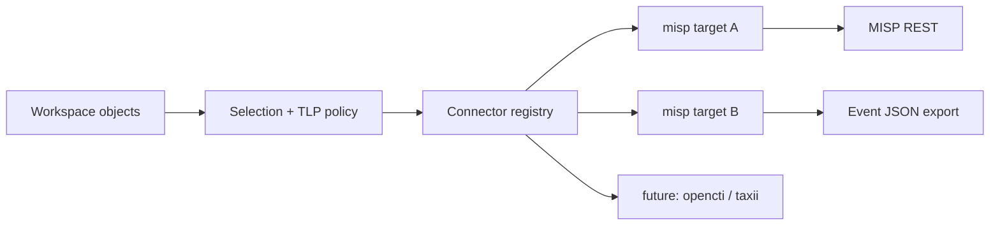
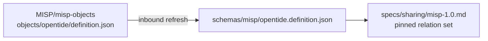

# RFC 0005: Sharing system and MISP connector

- **RFC:** 0005
- **Title:** Sharing system and MISP connector
- **Author:** Amine Besson
- **Status:** draft
- **Created:** 2026-09-15
- **Revised:** 2026-09-17 — document-transport revision, in place (see [Revision history](#revision-history))
- **Issue:** [#10](https://github.com/OpenTideHQ/specifications/issues/10)
- **PR:** [#9](https://github.com/OpenTideHQ/specifications/pull/9)

> Numbering note: [issue #8](https://github.com/OpenTideHQ/specifications/issues/8) reserved **RFC 0004** for the Sysdig Falco deployer. That RFC file is not in this repository yet. This proposal takes **0005** to avoid colliding with that reservation.

## Summary

Add a first-class **sharing** subsystem to OpenTide: a pluggable registry of sharing *targets*, workspace configuration that names those targets and their policy, and a CLI family `opentide share` that publishes Tide objects (threat, objective, rule) to external intelligence platforms. Sharing is **not** detection-platform deployment — `opentide deploy` remains the path to SIEMs and EDRs. The first connector is **MISP**.

The MISP connector is a **document transport**, not a field mapper. One MISP Event carries one Tide object, and that Event carries exactly one instance of the upstream [`opentide`](https://github.com/MISP/misp-objects/tree/main/objects/opentide) MISP object, whose `opentide-object` attribute holds the object document verbatim — comments, key order, and formatting preserved. Nothing is removed from that document. Exposure is decided by the object `metadata.tlp` value, the MISP `distribution` that value permits, and the MISP sharing group; it is never decided by filtering fields out of the payload. Tagging is restricted to TLP, PAP, and galaxy clusters from two galaxies (`threat-actor` and `mitre-attack-pattern`). Event identity belongs to the receiving instance: the Event UUID is MISP-assigned, and the connector finds an existing Event by a composite key — creator organisation plus the object UUID carried in the `opentide` object — so several organisations can publish their own version of the same OpenTide object without colliding.

This RFC is additive with respect to the object model. It does not revise `threat::1.0`, `objective::1.0`, or `rule::1.0`, and it adds or modifies no file under `specs/objects/` or `schemas/pins/`. After acceptance, follow-up PRs add `specs/sharing.md`, `specs/sharing/misp-1.0.md`, an additive `specs/metadata.md` `1.1` revision carrying an optional `metadata.pap` field, the pinned upstream template copy, and conformance fixtures. opentide implements the CLI and connector in a separate repository.

## Motivation

Detection-engineering teams already keep ATT&CK-mapped threats, objectives, and rules in an OpenTide workspace, with TLP on every object. They still copy that content into MISP by hand — or do not share it at all — because OpenTide can **deploy** a rule to Sentinel but cannot **publish** the surrounding detection knowledge to a CTI community.

Stakeholders:

- **Detection engineers** need a repeatable, TLP-aware `opentide share` whose output is predictable: what was authored is what is published.
- **CTI / ISAC operators** need MISP Events that round-trip OpenTide identity so communities can consume detections as intelligence and hand them back into a workspace, not as a lossy summary.
- **Implementers (opentide)** need a connector contract analogous to [platforms.md](../specs/platforms.md): capability matrix, TOML shape, honest failure modes, idempotent upsert.
- **Workspace maintainers** need to publish to more than one MISP instance — an internal instance and a sector ISAC, say — with per-instance credentials, per-instance policy, and no forked configuration.

Two things changed since the first draft of this RFC, and both point away from field decomposition.

**A document is the useful unit.** The first draft decomposed every object into MISP `detection` object attributes, event-level typed attributes, and a wide taxonomy tag set. That mapping is lossy in one direction and unfaithful in the other: OpenTide fields that no MISP template models (TVM `terrain`, `leverage`, `viability`, chaining; signal composition) had to become untyped `text` attributes with comments, while required template attributes OpenTide cannot fill needed placeholders. A consumer could not reconstruct the object, and an implementer had to re-derive dozens of per-family rules. Carrying the document itself makes consumption a single parse and makes a future inbound path (`share pull`) tractable rather than speculative. Upstream MISP now ships an `opentide` object template built for exactly this, which removes the earlier objection that document transport would require every receiving instance to install a custom template first.

**Filtering the payload was the wrong control.** The first draft carried five `include_*` switches plus a redacted-YAML attachment option, each deciding whether queries, internal references, tenants, or platform blocks were emitted. That is a second, weaker access-control system sitting beside the one OpenTide already has. TLP is on every object; MISP distribution and sharing groups already express reach. Deciding exposure twice — once by TLP and once by a per-field switch — produces objects that are neither faithful nor safe, and it makes conformance unverifiable because the emitted shape depends on flag combinations. This revision keeps one control surface: TLP, the distribution it permits, and the sharing group.

Without a spec, each workspace would invent its own export script, TLP handling would drift, and a later OpenCTI or TAXII connector would not share a CLI or config model.

## Detailed design

### Revision history

| Date | Change |
|------|--------|
| 2026-09-15 | Initial proposal: sharing subsystem, MISP connector with per-family field decomposition into MISP `detection` objects, broad taxonomy tagging, and `include_*` payload filtering. |
| 2026-09-17 | **This revision.** Replaces the field decomposition with document transport over the upstream `opentide` MISP object; removes payload filtering in favour of TLP, distribution, and sharing-group governance; restricts tags to TLP, PAP, and two galaxies; moves Event identity to MISP-assigned UUIDs with a composite lookup key; makes multi-instance publishing explicit; removes `event_mode`, `threat_level_source`, `verify_event_org`, `tag_namespace`, and the `include_*` family. |

Per **Decision D-1** this is an in-place revision, not a superseding RFC. RFC 0005 published no file under `specs/`, so there is no accepted normative text to supersede — only a proposal to correct before it becomes normative. Keeping number `0005`, the filename, the title, and the issue and PR links keeps one discussion thread and one reviewable history for one decision. A second RFC that superseded four subsections of an unimplemented first RFC would split the record without adding provenance. The removals, retentions, and question dispositions are recorded below rather than in a separate file.

### 1. Sharing is a sibling of deployment, not a platform

| Concern | Command | Config | Destination |
|---------|---------|--------|-------------|
| Detection runtime | `opentide deploy` | `deployment.toml`, `platforms/*.toml` | SIEM / EDR |
| Intelligence publication | `opentide share` | `sharing.toml`, `sharing/targets/*.toml` | CTI platforms (MISP first) |

MISP MUST NOT be added to the [platforms](../specs/platforms.md) capability matrix. A MISP instance is not a query engine and MUST NOT grow a `configurations.misp` block on `rule::1.0`.

Connectors register by **connector id** (`misp`). A workspace MAY define **multiple targets** of the same connector (for example `misp-internal` and `misp-isac`), each with its own URL, credentials, publishing organisation, sharing group, and TLP ceiling.



### 2. Deliverables after acceptance

Nothing in this list lands in the same PR as the RFC. This PR revises the RFC only; the spec files, pinned data, fixtures, and index updates follow after acceptance. [AGENTS.md](../AGENTS.md) permits that sequencing explicitly — spec, fixture, `SPECS.md`, and `CHANGELOG.md` updates go in the RFC PR *or* "follow-up after acceptance per maintainer guidance" — and it is the right split here because the removals below are large enough that reviewers should agree on the model before text is written against it.

| Path | Action | `schema_id` |
|------|--------|-------------|
| `specs/sharing.md` | **New** — connector-agnostic sharing system: CLI, selection, configuration merge, policy resolution, share report, exit statuses, share state, connector contract | — |
| `specs/sharing/misp-1.0.md` | **New** — MISP connector | `sharing::misp::1.0` |
| `specs/metadata.md` | Revise `1.0` → `1.1`, additive: optional `metadata.pap` | — |
| `schemas/misp/opentide.definition.json` | **New (vendored data)** — committed copy of the upstream `opentide` object template definition | — |
| `specs/configuration.md`, `specs/workspace.md`, `specs/validation.md` | Additive rows for sharing configuration files, generated sharing paths, and sharing fixture checker codes | — |
| `fixtures/sharing/valid/`, `fixtures/sharing/invalid/` | **New tree** — target TOML fixtures and golden Event JSON fixtures (see §9) | — |
| `SPECS.md`, `CHANGELOG.md`, `llms.txt` | Index the new specs and the `metadata` `1.1` bump | — |
| Object specs, `schemas/pins/`, `vocabularies/` | **No change.** `pap.vocab.toml` already carries the four `misp` PAP values | — |

No new object schema revision. `metadata.schema` values stay `threat::1.0` / `objective::1.0` / `rule::1.0`.

### 3. Configuration

#### 3.1 Merge and discovery

Sharing configuration follows the existing [configuration](../specs/configuration.md) merge order: bundled package → client `.opentide/configurations/` → parent instance. Vocabulary files remain non-overridable.

| File | May override? | Purpose |
|------|---------------|---------|
| `sharing.toml` | Yes | Global sharing policy, default targets, selection |
| `sharing/targets/<id>.toml` | Yes | Per-target connector, connection, identity, and policy |
| Secrets in TOML | Yes, but values MUST support `${ENV_VAR}` substitution (same pattern as `deployment.toml` proxy passwords) | API keys, optional client cert paths |

Top-level `sharing.toml` maps to config key `sharing`. Each `.toml` file directly under `sharing/targets/` becomes `sharing.targets.<identifier>`, keyed by `[target].identifier` when set and by the filename stem otherwise. Files with another extension, and files nested below `sharing/targets/`, are not loaded as targets. Identifiers are 1–64 characters of lowercase letters, digits, hyphen, and underscore; a duplicate resolved identifier is a configuration error naming every file involved. Because the identifier is resolved **per file before merging**, a client file merges onto the bundled file with the matching *identifier*, not the matching filename.

Bundled defaults MUST ship with sharing **disabled** (`enabled = false` on `[sharing]` and on every bundled target), matching platforms.

#### 3.2 `sharing.toml`

```toml
[sharing]
enabled = false               # master switch; no remote mutation while false
default_targets = []          # empty = all enabled targets
max_tlp = "amber"             # vocabulary `tlp` name; ceiling for every target unless a target sets a stricter value
allow_tlp_red = false

[sharing.selection]
object_types = ["threat", "objective", "rule"]
# Rules only: deployment statuses eligible to share. Threats/objectives have no status.
rule_statuses = ["PRODUCTION"]
```

| Field | Type | Required | Default | Semantics |
|-------|------|----------|---------|-----------|
| `enabled` | bool | no | `false` | Master switch. `opentide share` MUST refuse to push, publish, or retract when false (preview/status MAY still run). |
| `default_targets` | list[string] | no | `[]` | Target identifiers used when `--target` is omitted. Empty list means every target with `enabled = true`. |
| `max_tlp` | string | no | `amber` | MUST be a `tlp` vocabulary `name`. Objects whose `metadata.tlp` exceeds this ceiling are `skipped_tlp` in the share report (not a silent omit, and not exit `1`). TLP order for comparison: `clear` < `green` < `amber` < `amber+strict` < `red`. |
| `allow_tlp_red` | bool | no | `false` | TLP:RED MUST NOT be shared unless this resolves to `true` **and** the operator passes `--allow-tlp-red`. |
| `selection.object_types` | list[string] | no | all three families | Restrict families. |
| `selection.rule_statuses` | list[string] | no | `["PRODUCTION"]` | MUST match names from merged `deployment.toml`. Threats and objectives ignore this key. |

`max_tlp` and `allow_tlp_red` are the **only** two policy keys resolvable both globally and per target. A target MAY lower `max_tlp` or set `allow_tlp_red = false`; a target MUST NOT raise either. A looser target value is a configuration error raised before any target is contacted. CLI flags follow the same "strictest wins" rule, except `--allow-tlp-red`, which is the one flag able to widen a resolved value and only where `allow_tlp_red` already resolves to `true` for that target.

Two amendments to this section in this revision. `require_validation` moves from `[sharing]` to `[target]` (bundled default `true`), because policy resolution is now defined for exactly two keys and validation is a per-destination decision rather than a ceiling. The five payload-filtering keys (`include_internal_references`, `include_queries`, `include_platform_blocks`, `include_tenant_identifiers`, and the connector-level `include_object_yaml`) are removed outright; see §7.6.

#### 3.3 Target file (`sharing/targets/<id>.toml`)

Every target file MUST contain `[target]` with a known `connector`. Additional tables are connector-specific. An unrecognised **table** is recorded as a warning and does not prevent the target from loading, so a future connector can ship keys before an older CLI learns them — except `connector` itself, which MUST be recognised or the target is skipped with an error. An unrecognised **key** inside a known table is likewise a warning, unless it names a removed option (§7.1), which is an error.

Common `[target]` fields:

| Field | Type | Required | Default | Description |
|-------|------|----------|---------|-------------|
| `enabled` | bool | no | `false` | Participate in share runs |
| `identifier` | string | no | filename stem | Stable id used by `--target` |
| `name` | string | no | identifier | Display name |
| `connector` | string | **yes** | — | Connector id (`misp` for this RFC) |
| `schema` | string | **yes** for MISP | — | Connector schema id, e.g. `sharing::misp::1.0` |
| `require_validation` | bool | no | `true` | When true, push MUST run the default [validation](../specs/validation.md) checks on in-scope objects and MUST NOT share objects that raise errors. Warnings do not block. |
| `description` | string | no | `""` | Human notes |

Nothing in one target file changes the resolved configuration of another. Connection, credentials, publishing organisation, policy, and distribution are all per-target, and each target MAY name a distinct environment variable for the same key.

### 4. CLI: `opentide share`

Normative command family. Implementations MUST provide these subcommands; `opentide share` with no subcommand MUST mean `push`.

| Command | Purpose |
|---------|---------|
| `opentide share` / `opentide share push` | Publish in-scope objects to selected targets |
| `opentide share preview` | Build payloads, apply policy, write nothing to the remote (equivalent to `push --dry-run`) |
| `opentide share status` | Show local share state vs object versions (no remote mutation) |
| `opentide share retract` | Unpublish (default) or delete (`--delete`) remote records for in-scope objects |
| `opentide share targets` | List configured targets, connector, enabled flag, and redacted connection (URL yes, API key never) |

Shared flags (push / preview / retract):

| Flag | Effect |
|------|--------|
| `--target <id>` | Repeatable. Restrict to named targets. Unknown id is an error; naming a disabled target is an error and MUST NOT re-enable it. |
| `--uuid <uuid>` | Repeatable. Narrow to objects. |
| `--type <family>` | Repeatable. `threat`, `objective`, `rule`. |
| `--file <path>` | Repeatable. Narrow to YAML files. |
| `--dry-run` | On `push`: same as `preview`. |
| `--allow-tlp-red` | Required in addition to `allow_tlp_red = true` to share TLP:RED. |
| `--publish` / `--no-publish` | Override target `publish` for this run (MISP: whether to call publish after upsert). |
| `--workers` | Optional parallelism across **HTTP** upserts; default implementation-defined. MUST NOT change any object's outcome: each object's payload and policy decision are computed independently of every other object and of completion order. |

Scope rules MUST match [validation](../specs/validation.md): `--file` / `--uuid` / `--type` that match nothing MUST fail with `scope_no_match` rather than succeeding vacuously. The same applies to target selection: an unmatched `--target` value or `default_targets` entry, and an empty resolved target set, are `scope_no_match`.

Exit status (whole command, not per target; object-level outcomes live in the share report). Implementations MUST choose **exactly one** code using this order:

1. Preflight (validation, policy misconfiguration, `sharing_group_unresolved` before any Event is written, file-mode `sharing-group` with `sharing_group_id = 0`, `organisation_uuid_mismatch` on every selected target, `scope_no_match`) → `1`.
2. Else if at least one object action succeeded (`created` / `updated` / `unchanged` / `retracted`) **and** at least one object or target `failed` → `3`.
3. Else if no object `failed` → `0`. Policy skips (`skipped_tlp`, `skipped_status`) are not `failed`. An all-skip run is `0`.
4. Else (at least one `failed`, no successful object action): if every `failed` is authentication or connectivity → `2`; otherwise → `1`.

| Code | Meaning |
|------|---------|
| `0` | Preflight passed and no object `failed`. Policy skips are reported and do not fail the run. |
| `1` | Preflight error, **or** total failure that is not solely auth/connectivity (every object `failed` with `ambiguous_remote_event`, `remote_update_rejected`, HTTP 5xx, `template_missing`, and similar). |
| `2` | No successful object action, and every `failed` is authentication or connectivity. If any object succeeded while another had auth failure, use `3` (step 2). |
| `3` | Partial success: at least one successful object action **and** at least one `failed` object or target. Includes mixed objects on **one** target and mixed targets. |

This order is a partition: a sole-target run of only `ambiguous_remote_event` / HTTP 5xx is `1`; only auth/connectivity is `2`; mixed success and failure is `3`; policy skips with no `failed` remain `0`.

Stdout SHOULD be a structured share report (human table by default; `--json` MAY be offered). The report MUST carry exactly one record per pair of object `metadata.uuid` and target identifier, each with exactly one action (`created`, `updated`, `unchanged`, `skipped_tlp`, `skipped_status`, `retracted`, `failed`), the remote identifier where one exists, and a reason on every `skipped_*` and `failed`. Informational notes MAY be attached to a record without changing its action.

Secrets MUST NOT appear in logs, reports, or preview payloads: every API key value, authorization header value, and value substituted from a `${ENV_VAR}` placeholder is replaced with a fixed redaction marker. Target `url` and `organisation_uuid` values carry no credential and are emitted unredacted.

### 5. Workspace layout and share state

Additions to [workspace.md](../specs/workspace.md):

| Path | Purpose | Client-edited? |
|------|---------|----------------|
| `.opentide/configurations/sharing.toml` | Global sharing overrides | Yes |
| `.opentide/configurations/sharing/targets/` | Per-target TOML | Yes |
| `.opentide/sharing/state.json` | Last successful share mapping | **No** — generated |
| `.opentide/exports/sharing/<target id>/` | Preview / `mode = "file"` Event JSON | **No** — generated |

The export directory is per target, so two targets never write Event JSON to the same directory. This replaces the single `[misp.file].directory` default of the first draft.

`state.json` is an implementation artifact, not a Tide object. It holds at most one entry per pair of object UUID and target identifier, so one object carries one independent entry per target:

| Field | Description |
|-------|-------------|
| `object_uuid` | Tide `metadata.uuid` |
| `object_schema` | `metadata.schema` |
| `object_version` | `metadata.version` at last successful share |
| `content_hash` | Hash of the emitted object document for that target |
| `target_id` | Sharing target identifier |
| `connector` | `misp` |
| `organisation_uuid` | Publishing organisation UUID observed for the matched Event |
| `remote_event_uuid` | MISP Event UUID **as assigned by the instance** |
| `remote_event_id` | MISP numeric id, or explicit null when not observed |
| `published` | Whether the event was published |
| `shared_at` | ISO-8601 UTC timestamp |

State is a regenerable cache, not an authority. Push locates the remote Event by the composite key of §7.5, and the remote result wins on any disagreement: differing fields are overwritten with observed values, and an entry is discarded when the lookup finds no Event. Deleting `state.json` changes no outcome except replacing `unchanged` with `updated`.

Generated sharing paths MUST NOT be committed as hand-edited sources (same rule as `.opentide/exports/`). Implementations SHOULD gitignore `state.json`.

### 6. Connector registry (generic)

A connector implementation MUST declare:

| Capability | MISP 1.0 |
|------------|----------|
| `identifier` | `misp` |
| `schema` | `sharing::misp::1.0` |
| `push` | yes |
| `preview` | yes (payload without HTTP mutation) |
| `status` | yes (local state; MAY optionally view the remote) |
| `retract` | yes (unpublish; optional delete) |
| `pull` | **no** (inbound MISP → OpenTide is out of scope) |

Connectors without `pull` MUST NOT advertise import. Each connector spec MUST also publish its own **removed keys** table; the config loader rejects any key in the union of the global removed set and the resolved connector's set before contacting any target, so a future connector does not inherit MISP's removed keys.

Future connectors (OpenCTI, TAXII 2.1 collections) get their own `sharing::<id>::1.0` specs; this RFC does not specify them.

### 7. MISP connector (`sharing::misp::1.0`)

#### 7.1 Target TOML

```toml
[target]
enabled = false
identifier = "misp-internal"
name = "Internal MISP"
connector = "misp"
schema = "sharing::misp::1.0"
require_validation = true
description = "Internal MISP instance"

[connection]
url = "https://misp.internal.example.org"
api_key = "${MISP_INTERNAL_API_KEY}"
verify_ssl = true
timeout_seconds = 30
# optional client TLS
# client_cert = "${MISP_CLIENT_CERT}"
# client_key = "${MISP_CLIENT_KEY}"

[misp]
organisation_uuid = "00000000-0000-4000-8aaa-000000000001"  # publishing org; half of the lookup key
mode = "api"                     # api | file
publish = false                  # call the publish endpoint after upsert
distribution = "this-community"  # clamped to the TLP-allowed set below
sharing_group_id = 0             # required for distribution 4 in file mode; API fallback if UUID empty
sharing_group_uuid = ""          # preferred in api mode; resolved against the instance (not in file mode)
analysis = "completed"           # initial | ongoing | completed
info_prefix = "[OpenTide] "      # optional, ≤ 32 characters, prepended to Event info verbatim
extra_tags = []                  # optional constant tags, ≤ 10 entries of 1–255 characters

[misp.file]
# used when mode = "file"; defaults to .opentide/exports/sharing/<target id>/
directory = ".opentide/exports/sharing/misp-internal"
```

A second target file is a second MISP instance, with its own credentials, its own publishing organisation, and its own — never looser — policy:

```toml
[target]
enabled = false
identifier = "misp-isac"
connector = "misp"
schema = "sharing::misp::1.0"

[connection]
url = "https://misp.isac.example.net"
api_key = "${MISP_ISAC_API_KEY}"    # distinct environment variable per target

[misp]
organisation_uuid = "00000000-0000-4000-8aaa-000000000002"
mode = "api"
distribution = "sharing-group"
sharing_group_uuid = "00000000-0000-4000-8bbb-000000000001"
sharing_group_id = 0
publish = true
max_tlp = "green"                   # stricter than the global amber; a looser value is an error
```

**`[connection]`**

| Field | Type | Required | Default | Notes |
|-------|------|----------|---------|-------|
| `url` | string (URL) | **yes** when `mode = "api"` | — | Origin only (scheme + host + optional port/path prefix). Trailing slash ignored. |
| `api_key` | string | **yes** when `mode = "api"` | — | MUST be provided via env substitution in committed config. Literal keys in git SHOULD raise a validation warning; MUST NOT be printed. An `${ENV_VAR}` naming an unset or empty variable is a configuration error that excludes that target before any request. |
| `verify_ssl` | bool | no | `true` | |
| `timeout_seconds` | number | no | `30` | Per-request timeout |
| `client_cert` / `client_key` | string | no | — | Mutual TLS |

**`[misp].organisation_uuid`** is required for connector `misp`. It is the canonical 36-character UUID of the MISP organisation under which this target publishes, and it is half the lookup key of §7.5. It is resolved independently per target, so two targets may declare two different organisations. Absence or a malformed value is a configuration error that excludes that target from the run while every other target continues.

In `mode = "api"`, before any create or update, the connector MUST read the organisation UUID of the authenticated API key and compare it case-insensitively to the declared value. A mismatch fails that target with `organisation_uuid_mismatch` and writes nothing — because Events created under the key's actual organisation would never match the lookup key and would therefore duplicate on every subsequent run. A read failure fails that target with `organisation_uuid_unverified`; remaining targets continue. In `mode = "file"` the declared UUID is written into the exported document as the intended creator organisation and no verification request is made; a file export carries that risk unverified until the document is imported.

**Removed options.** Supplying any of these in a resolved configuration is an error naming the key and, where target-scoped, the target identifier, raised before any target is contacted:

| Key | Replaced by |
|-----|-------------|
| `event_mode` (and `bundle` mode) | One Event per Tide object is the only event mode (D-7) |
| `threat_level_source` | The single mapping table of §7.4 |
| per-target `threat_level_id` | Derived per object by that same table (D-3) |
| per-target PAP option | Object-level `metadata.pap` (D-8) |
| `verify_event_org` | The organisation half of the lookup key (§7.5) |
| `tag_namespace` | The `opentide:*` tag namespace is gone (§7.3) |
| `include_queries`, `include_internal_references`, `include_tenant_identifiers`, `include_platform_blocks`, `include_object_yaml` | TLP, distribution, and sharing-group governance (§7.6) |

**`[misp]` distribution enum** (config strings → MISP integer):

| Config value | MISP `distribution` | When to use |
|--------------|---------------------|-------------|
| `your-organization` | `0` | Org-only; the only allowed value for `amber+strict` and `red` |
| `this-community` | `1` | Typical `green` community instance |
| `connected-communities` | `2` | Wider sync mesh; `clear` / `green` only |
| `all-communities` | `3` | `clear` only |
| `sharing-group` | `4` | Named channel (not a point on the 0–3 width scale). Requires a sharing-group identifier; **how** is mode-specific (table below) |

If `distribution = "sharing-group"`, fail that target **before** any event is written when the mode-specific identifier rule is not met:

- `api`: neither `sharing_group_uuid` nor a non-zero `sharing_group_id` is set.
- `file`: `sharing_group_id` is 0 (a UUID alone is not enough; see the `file` row below).

| Mode | Sharing-group identifier rule |
|------|-------------------------------|
| `api` | `sharing_group_uuid` is preferred. When set, implementations MUST resolve it against the instance's sharing groups on each run (UUID wins if both are set). If the UUID is empty, use a non-zero `sharing_group_id`. If the UUID is set and not found, fail the target (`sharing_group_unresolved`). |
| `file` | MUST NOT contact the instance (`url` / `api_key` are not required). A non-zero `sharing_group_id` is **required**, because the exported Event document carries a numeric sharing group. UUID-only file config (`sharing_group_id = 0`) MUST fail before any file is written. The UUID MAY be copied into export metadata; it MUST NOT be treated as resolved. |

`sharing_group_id` MUST be `0` whenever the resolved distribution is any value other than `sharing-group`.

**TLP → allowed distributions.** MISP `sharing-group` (4) is a membership list, not a width between 0 and 3, so resolution is a **set membership** check rather than `min()` on integers. For each object, compute the allowed set from `metadata.tlp`. If `[misp].distribution` is omitted, use the default in that row. If it is set and **in** the allowed set, use it. If it is set and **not** in the allowed set, use the row default (do not fail the object solely for this clamp).

| Object `metadata.tlp` | Allowed `[misp].distribution` values | Default (config omitted) |
|-----------------------|--------------------------------------|--------------------------|
| `clear` | `your-organization`, `this-community`, `connected-communities`, `all-communities`, `sharing-group` | `all-communities` (3) |
| `green` | `your-organization`, `this-community`, `connected-communities`, `sharing-group` | `this-community` (1) |
| `amber` | `your-organization`, `sharing-group` | `sharing-group` (4) if a group is configured, else `your-organization` (0) |
| `amber+strict` | `your-organization` | `your-organization` (0) |
| `red` | `your-organization` | not shared unless `allow_tlp_red` resolves true **and** `--allow-tlp-red` is passed; then `your-organization` (0) |

Examples: target `distribution = "this-community"` with TLP `amber` clamps to `your-organization` (1 is not allowed for amber). Target `distribution = "all-communities"` with TLP `green` clamps to `this-community`. Target `distribution = "sharing-group"` with TLP `amber+strict` clamps to `your-organization`.

**`mode = "file"`** writes one JSON document per event under `[misp.file].directory` (created if missing), default `.opentide/exports/sharing/<target id>/`. Filenames SHOULD be derived from the object UUID, since the Event UUID does not exist yet in file mode. File mode still applies the TLP ceiling, the `allow_tlp_red` gate, and the distribution rules; it makes no HTTP request, which means no sharing-group resolution, no organisation verification, and no galaxy cluster resolution — unresolvable cluster tags are omitted with a note exactly as in §7.3.

#### 7.2 HTTP API (normative subset)

Minimum MISP version: the first release shipping the upstream `opentide` object template. Implementations SHOULD document the tested line in the follow-up spec.

Auth: every request MUST send the API key as MISP expects (`Authorization: <key>`). Implementations MUST NOT put the key in query strings.

| Operation | Method / path | Use |
|-----------|---------------|-----|
| Server identity | `GET /servers/getVersion` (or equivalent user/me) | Connectivity probe; also the source of the authenticated organisation UUID for the §7.1 pre-flight check |
| Find event by object attribute | Event search constrained to the publishing organisation, matching the `opentide` object `uuid` attribute value | The lookup key of §7.5 |
| View event | `GET /events/view/<uuid-or-id>` | Read a matched Event, including `Orgc` and its objects |
| Add event | `POST /events/add` | Create, including the nested object and tags |
| Edit event | `POST /events/edit/<id>` | Update after lookup |
| Publish | `POST /events/publish/<id>` | When `publish = true` |
| Unpublish | `POST /events/unpublish/<id>` | Retract default |
| Delete event | `DELETE /events/<id>` | Retract `--delete` |
| Add object | `POST /objects/add/<event_id>` | When the `opentide` object is added after event create |
| List sharing groups | Sharing-group listing | Resolve UUID → numeric id (`mode = api` only) |
| Galaxy cluster lookup | Read-only galaxy cluster search | Resolve `threat-actor` and `mitre-attack-pattern` clusters (§7.3) |

The event-search and sharing-group rows describe intent, not a verified request shape; both are flagged in [Unresolved questions](#unresolved-questions) (N-4, N-5) and MUST be pinned against MISP before `specs/sharing/misp-1.0.md` is written.

PyMISP is the **recommended** opentide implementation library; the spec is HTTP/JSON, not Python. Any client that speaks this subset conforms.

On `401`/`403`, the target MUST fail with "authentication failed" without dumping response bodies that might include keys. Galaxy or sharing-group lookups that fail for transport, timeout, or authorization reasons fail the affected object with `galaxy_lookup_failed` or the target with `sharing_group_unresolved`; they MUST NOT silently degrade into a guessed value. Cluster lookups MUST be read-only: the connector never creates, modifies, enables, deletes, or uploads a galaxy or cluster.

#### 7.3 Tags and galaxies

The emitted tag set is closed to three sources, plus an opt-in escape hatch:

| Source | Cardinality | Value |
|--------|-------------|-------|
| `tlp` vocabulary `misp` value for `metadata.tlp` | exactly 1 | `tlp:clear` … `tlp:red` |
| `pap` vocabulary `misp` value for `metadata.pap` | 0 or 1 | `PAP:WHITE` … `PAP:RED` |
| `threat-actor` galaxy cluster | 0..n | `misp-galaxy:threat-actor="<cluster value as returned by the instance>"` |
| `mitre-attack-pattern` galaxy cluster | 0..n | `misp-galaxy:mitre-attack-pattern="<cluster value as returned by the instance>"` |
| `[misp].extra_tags` | 0..10 | Free-form constants configured on the target |

Emission order, so a golden fixture is byte-comparable across runs: TLP, PAP, `threat-actor` clusters, `mitre-attack-pattern` clusters, then `extra_tags`; ascending code point order within each group; each distinct tag string at most once.

TLP and PAP tag strings are copied character-for-character from the `misp` field of the matching `[[keys]]` entry in [tlp.vocab.toml](../vocabularies/tlp.vocab.toml) and [pap.vocab.toml](../vocabularies/pap.vocab.toml). A `metadata.tlp` value that is absent or matches no key fails the object with `unmapped_tlp`; a `metadata.pap` value that matches no key fails it with `unmapped_pap`. An absent `metadata.pap` emits no PAP tag — PAP is emitted only when the object carries it (D-8), and there is no per-target PAP default.

`extra_tags` is retained deliberately (D-5) with bounds (at most 10 entries of 1–255 characters) and one honest caveat the follow-up spec must carry: the closed tag set above is only provable while a target's `extra_tags` is absent or empty. An extra tag in the `opentide` namespace, or in one of the six vocabularies removed below, is a configuration error.

**Removed from the first draft:** the tag rows for maturity, RSIT, kill chain, sectors, criticality, and viability, and the whole `opentide:*` bookkeeping namespace with its `tag_namespace` option. Those six vocabularies now travel inside the object document only. Family, schema, version, object UUID, and rule status travel as `opentide` object attributes and inside the document, so duplicating them as tags added maintenance without adding information.

**Cluster resolution is a lookup, never a construction.** The connector MUST resolve every cluster against the target instance and MUST emit the cluster `value` string exactly as the instance returns it. It MUST NOT derive a cluster value from an OpenTide vocabulary field: `att&ck::1.0` `name` values use a `<Parent>: <Sub-technique>` form that does not equal a MISP cluster value, and silently constructing one produces a tag that looks right and matches nothing.

| Identifier source | Galaxy | Lookup — first key yielding exactly one match |
|-------------------|--------|----------------------------------------------|
| `threat.att&ck[]`, objective `attack[]`, rule `techniques[]` | `mitre-attack-pattern` | `meta.external_id` contains the technique id, compared case-insensitively after trimming |
| `threat.actors[].name` with `actors::1.0` scope `att&ck::` | `threat-actor` | (a) `meta.external_id` contains the id; else (b) `meta.refs` holds a URL whose final non-empty path segment equals the id; else (c) `meta.synonyms` contains the id |
| `threat.actors[].name` with `actors::1.0` scope `misp::` | `threat-actor` | cluster `uuid` equals the scoped identifier, canonical form, case-insensitive |

Failure modes are all non-fatal to the Event, because a missing cluster is a property of the receiving instance rather than a defect in the object (D-6):

| Condition | Behaviour |
|-----------|-----------|
| Actor name carries no scope, or a scope other than `att&ck::` / `misp::` | Omit the tag, note `actor_unscoped`. Bare strings MUST NOT be coerced. |
| No cluster matches (including a technique id that is not `T####` or `T####.###`) | Omit the tag, note `cluster_not_found`, emit the Event, outcome class unchanged |
| More than one cluster matches | Omit the tag, note `cluster_ambiguous` listing every matched cluster UUID; never pick one arbitrarily |
| Lookup fails for transport, timeout, or authorization reasons | Fail the object with `galaxy_lookup_failed`; leave the remote Event unmodified |

A sub-technique emits its own cluster tag only. The parent technique is emitted only when the object lists the parent identifier separately, because inferring the parent invents a mapping the author did not write.

#### 7.4 Event envelope

The connector derives exactly seven Event fields:

| Field | Source |
|-------|--------|
| `info` | `info_prefix` concatenated with the object top-level `name`, no separator inserted, truncated to the first 255 characters |
| `date` | UTC calendar date of `metadata.created` in `YYYY-MM-DD`, on create and update alike — never the run date |
| `distribution` | The TLP-narrowed value of §7.1 |
| `sharing_group_id` | The resolved numeric group when distribution is `4`; otherwise `0` |
| `threat_level_id` | The mapping table below |
| `analysis` | `[misp].analysis`: `initial`→`0`, `ongoing`→`1`, `completed`→`2`; default `completed` |
| `published` | `false` in every create and update payload; publishing is a separate call gated by `publish` / `--publish` |

The field set is closed **by choice**, not by observation. Document transport needs exactly four things from the envelope: routing (`distribution`, `sharing_group_id`), triage (`threat_level_id`, `analysis`), human labelling and ordering (`info`, `date`), and publication state (`published`). Everything an object could otherwise contribute is inside the document, where it is lossless. Keeping the set closed is what makes a golden fixture a complete expectation rather than a sample.

`uuid`, `timestamp`, `orgc_id`, `org_id`, `Orgc`, `Org`, `event_creator_email`, `EventReport`, and `CryptographicKey` are server-owned and MUST NOT be set. The Event `uuid` in particular is assigned by the receiving instance (§7.5) and is echoed by the connector only to address an existing Event on update.

`info_prefix` exists because the first draft's unresolved question 10 asked for it: communities want a framework or organisation marker in the Event title. It is a per-target string of at most 32 characters, concatenated verbatim — the operator supplies any trailing space they want — and defaults to empty. An `analysis` value outside the three names, or an `info_prefix` longer than 32 characters, fails that target before any Event is written.

An object whose top-level `name` is absent or empty after trimming, or whose `metadata.created` is absent or not a valid `YYYY-MM-DD` date, is `failed` with the offending field named, and no remote Event is created or modified.

**`threat_level_id`** (MISP: `1` High, `2` Medium, `3` Low, `4` Undefined) is derived from the object, never configured. The source field is per family: threat → top-level `criticality`; rule → top-level `severity`; objective → none. One table covers all three OpenTide severity scales. The OpenTide scales and the MISP scale are separate namespaces, and neither `severity.vocab.toml` nor `alert_severity.vocab.toml` carries a `misp` field, so this translation is introduced here rather than read from vocabulary data.

| OpenTide scale | Source values | `threat_level_id` |
|---|---|---|
| `criticality::1.0` | `Emergency`, `Severe`, `High` | `1` |
| `criticality::1.0` | `Medium` | `2` |
| `criticality::1.0` | `Low`, `Baseline - Minor`, `Baseline - Negligible` | `3` |
| `severity::1.0` | `National cyber emergency`, `Highly significant incident`, `Significant incident` | `1` |
| `severity::1.0` | `Substantial incident`, `Moderate incident` | `2` |
| `severity::1.0` | `Localised incident` | `3` |
| `alert_severity::1.0` | `Critical`, `High` | `1` |
| `alert_severity::1.0` | `Medium` | `2` |
| `alert_severity::1.0` | `Low`, `Informational` | `3` |
| — | every objective; absent or unmatched source value | `4` |

Values are matched against the full vocabulary `name` (case-sensitive first, then case-insensitive equality), never by substring or token — `minor` must not match `Baseline - Minor`. A rule `severity` value is matched against both the `severity::1.0` and `alert_severity::1.0` rows; see [Observations not acted on](#observations-not-acted-on) for why. `Low` and `Medium` appear in more than one scale and resolve identically in each, so cross-scale matching needs no knowledge of which scale a value came from.

This replaces the first draft's `threat_level_source` option and its four tables, and it rejects a per-target constant: two objects of different severity published to one instance must not arrive indistinguishable.

#### 7.5 The single `opentide` object, identity, and idempotency

Every Event carries **exactly one** MISP object, an instance of the upstream `opentide` template, and **zero** Event-level attributes. Every attribute the connector emits is a member of that object. No `detection`, `sigma`, or `yara` object is emitted, and no MISP `ObjectReference` entry is created.

The template is pinned by identity, and this repository commits a copy of the upstream definition at `schemas/misp/opentide.definition.json` so that the pinned relation set is reviewable data rather than a claim in prose:

| Property | Value |
|----------|-------|
| Name | `opentide` |
| `uuid` | `892fd46a-f69e-455c-8c4f-843a4b8f4295` |
| `version` | `4` |
| `meta-category` | `misc` |
| Required relations | `name`, `opentide-object`, `opentide-type`, `uuid`, `version` |
| Optional repeatable relation | `opentide-relation` (`multiple: true`) |
| MISP attribute type on every relation | `text` |

| Relation | Cardinality | Source | `disable_correlation` (from the template) |
|----------|-------------|--------|:-----------------------------------------:|
| `name` | exactly 1 | Object top-level `name`, verbatim: no truncation, case change, or whitespace normalisation | `false` |
| `uuid` | exactly 1 | `metadata.uuid`, verbatim. Never the Event UUID or the MISP object UUID | `false` |
| `version` | exactly 1 | `metadata.version` as a decimal digit string, no leading zeroes, no quotes, no prefix. The template's `sane_default` of `1` MUST NOT be substituted for a real value | `true` |
| `opentide-type` | exactly 1 | Family mapping below | `true` |
| `opentide-object` | exactly 1 | The object document, verbatim (see §7.6) | `false` |
| `opentide-relation` | 0..n | Parent object UUIDs, below | `false` |

| Object family | `opentide-type` |
|---------------|-----------------|
| `threat` | `tvm` |
| `objective` | `dom` |
| `rule` | `mdr` |

`tvm`, `dom`, and `mdr` are the only values the upstream template's `values_list` accepts. They are MISP-side legacy names for the OpenTide families and MUST NOT be introduced as OpenTide object identifiers.

A missing required relation on the target instance's template fails the object with `template_relation_missing`, naming each absent relation. A missing template altogether fails it with `template_missing`. A `template_version` that differs from the pinned `4` while all five required relations are present is an informational note, not a failure — the connector emits the pinned relation set and continues. There is no `template_version_unsupported` reason.

Updates are confined to the seven envelope fields, the tag set, and the one `opentide` object. Remote objects or Event-level attributes the connector did not emit are left in place with an informational note, and the remote Event `uuid` and creator organisation are never rewritten.

**Relations point from child to parent.** The template documents `opentide-relation` only as "UUID of other OpenTIDE Objects with a relation to this Object", so direction is a choice this RFC makes:

| Family | Source field | Emitted |
|--------|--------------|---------|
| `threat` | — | zero relations |
| `objective` | `objective.threats[]` | one per distinct UUID |
| `rule` | top-level `detection_model` | zero or one |

Child-to-parent is chosen because a child always knows its parent while a parent does not enumerate its children. Emitting from the child needs no workspace-wide graph walk, and adding a rule never forces a re-push of the objective or threat above it. Values are 36-character lowercase canonical UUIDs of Tide objects — never MISP Event or object UUIDs — at most one attribute per distinct UUID, ordered ascending lexicographically so a golden fixture is stable. A relation value that is not a canonical UUID fails the object. A relation source that is absent, null, or an empty list emits zero relations and is a normal success. A relation UUID whose object was not shared to that target is still emitted, with an informational note (D-4): the value is OpenTide identity, and withholding it would make the record depend on share history.

No `extends_uuid` value is set and no MISP event extension is created. The first draft's parent-presence machinery — a pre-HTTP share plan, a remote presence probe, and rules about MISP `published` state — existed only to keep `extends_uuid` from dangling. Carrying the parent UUID as an attribute value removes the whole problem: the record is correct on emission, needs no ordering guarantee, and repairs itself when the parent is shared later.

**Event identity.** The Event UUID is assigned by the receiving instance and is never forced to equal `metadata.uuid`. The reason is the multi-publisher case, not an implementation convenience: in a shared community, several organisations may each publish their own version of the same OpenTide object, each under their own MISP organisation. If the Event UUID were the object UUID, the second publisher's Event would collide with the first's, and every instance would have to choose between rejecting the publication and overwriting another organisation's record. So the connector locates its own Event by a composite key, and both halves are required (D-2):

```
lookup key = (Event.Orgc.uuid == target [misp].organisation_uuid)
           ∧ (opentide object `uuid` attribute == Tide object metadata.uuid)
```

`Orgc.uuid` is compared as a canonical UUID, case-insensitively; the `uuid` attribute is compared as an exact case-sensitive string. An Event satisfying only one half is **no match**.

| Lookup result | Stored content hash | Outcome | Action |
|---------------|---------------------|---------|--------|
| No match | any | `created` | Create without setting an Event `uuid`; store the UUID the instance returns |
| Exactly one | absent or different | `updated` | Update within the scope above; store the new hash |
| Exactly one | equal | `unchanged` | Issue no create, update, or publish request |
| More than one | any | `failed` / `ambiguous_remote_event` | Report every matched Event UUID; write nothing |
| Object UUID matches, organisation differs | any | not a match | Another publisher's Event. Leave it untouched, exclude it from the match count, record an informational note |
| Transport / auth failure | any | `failed` / `remote_lookup_failed` | Leave state unchanged; repair on a later run |
| Update rejected | any | `failed` / `remote_update_rejected` | **Never** fall back to create — that is how duplicates are born |

Because the organisation is *part of the key* rather than a check applied after matching, the first draft's `verify_event_org` option and its `org_mismatch` reason are removed. A foreign publisher's Event is the expected shape of a healthy community, not an error, and it must neither trigger an ambiguity failure nor block this target from creating its own Event.

The content hash is computed over the emitted object document, locally, before any request. It is therefore unaffected by anything the receiving instance may normalise on ingest.

#### 7.6 Unredacted payload governed by TLP and distribution

The `opentide-object` attribute carries **one** value: the verbatim byte sequence of the source object document, as plain UTF-8 YAML text — comments, key order, indentation, and blank lines preserved, no canonical re-serialisation, no base64 or compression, no truncation, no splitting across attributes, and no envelope, shard wrapper, or transport header around the body (D-11).

Two contracts follow by construction rather than by rule. The emitted document is exactly one YAML document parsing to a mapping at the root, and it passes the `uuid-format` and `schema` checks of [validation.md](../specs/validation.md) against its own `metadata.schema` whenever the source object does — the workspace-scope `id-uniqueness` check and the cross-object `References` and `Chaining` sub-steps are outside the contract, because a single detached document carries no workspace registry. And every authored value, including the top-level key set, is character-for-character equal to the source. `require_validation` (default `true`) runs those checks before payload construction and records an object raising `error`-severity issues as `failed` / `validation_error`; warning-severity issues continue with a note. With `require_validation = false`, construction proceeds and each unvalidated object UUID is noted.

**Nothing is removed.** No field, key, comment, or value is dropped, emptied, masked, replaced, or truncated for any target, any `metadata.tlp` value, any configuration key, or any run flag. `references.internal`, platform `tenants`, `response.procedure.searches[].query`, and every `query`, `search`, `condition`, `sigma`, `yara`, and hunt `details` value an object carries reach every recipient the resolved distribution and sharing group permit. TLP:RED is shared on the same terms as any other TLP value where `allow_tlp_red` resolves true and `--allow-tlp-red` is passed, carrying its complete body (D-12).

The exposure controls are exactly four: the resolved `max_tlp` ceiling, the resolved `allow_tlp_red` gate, the TLP-to-allowed-distribution set membership of §7.1, and the sharing group named by the target. Payload filtering is not among them. Withholding content from a recipient is done by raising the object's `metadata.tlp`, by narrowing the target's distribution or sharing group, or by leaving the object out of the selection — there is no per-field mechanism, and the follow-up spec MUST carry this consequence in its own text so that an operator learns it before configuring a target.

The first draft's §7.6 is removed wholesale: the `include_queries`, `include_internal_references`, `include_tenant_identifiers`, `include_platform_blocks`, and `include_object_yaml` options; the `skipped_redaction` and `skipped_yaml` report outcomes; and the prohibition on attaching the source document unmodified, which this revision reverses — carrying the verbatim document is now the required behaviour. No replacement option, flag, or default may remove a field.

**One prohibition survives, and it is connector-side.** No workspace configuration value, no `[connection].api_key` value, no authorization header value, and no value substituted from a `${ENV_VAR}` placeholder is ever injected into the document, the object, the envelope, the tag set, the share report, the share state, or CLI output. This constrains what the *connector adds*; it is not a payload filter. A value an author wrote into the object body is shared as authored, even if it resembles a credential.

`preview` and `push` produce a byte-identical `opentide-object` value and the same outcome class for the same object, target, and resolved policy — so a golden fixture is a single expectation for both. The content hash and the TLP gate are evaluated before any create, update, or publish call.

#### 7.7 Retract

| Retract mode | MISP action |
|--------------|-------------|
| default | `unpublish` if published; leave the event in place |
| `--delete` | delete the event (destructive). Implementations SHOULD require `--yes` or an equivalent non-interactive confirm flag in CI, and MUST drop the object's share-state row so a later run does not address a deleted Event |

Retract is still TLP-scoped: it operates on previously shared records in state or on the remote, not on objects that were never pushed.

#### 7.8 Example — authored object vs emitted Event (preview)

Author YAML (fixture-style; every value below is a placeholder):

```yaml
name: Suspicious PowerShell Encoded Command
metadata:
  uuid: 00000000-0000-4000-8003-000000000010
  schema: rule::1.0
  version: 3
  created: "2026-01-01"
  modified: "2026-02-04"
  tlp: amber
  pap: amber            # optional, from the metadata 1.1 revision
  author: detection-team
description: Detects encoded PowerShell command lines used for credential access.
status: PRODUCTION
severity: High
techniques:
  - T1059.001
detection_model: 00000000-0000-4000-8002-000000000001
references:
  internal:
    runbook: https://wiki.internal.example.org/runbooks/encoded-powershell
response:
  alert_severity: High
  procedure:
    analysis: Confirm parent/child process chain and account context.
configurations:
  sentinel:
    enabled: true
    # the query travels with the document; TLP and distribution decide who reads it
    query: |
      SecurityEvent
      | where EventID == 4688
      | where CommandLine has "-enc"
```

Emitted Event, target `misp-internal` from §7.1 (informative). Every envelope value is derived, not chosen:

- `info` — `info_prefix` `"[OpenTide] "` concatenated with the object `name`.
- `date` — the calendar date of `metadata.created`.
- `distribution` `0` — TLP `amber` permits only `your-organization` and `sharing-group`; the target declares `this-community`, which is not in that set, so the row default applies, and no sharing group is configured on this target.
- `sharing_group_id` `0` — the resolved distribution is not `4`.
- `threat_level_id` `1` — rule `severity: High`, matched through the `alert_severity::1.0` rows of §7.4.
- `analysis` `2` — target `analysis = "completed"`.
- `published` `false` — always, in create and update payloads alike.
- No `extends_uuid`, no `ObjectReference`; the objective UUID is an `opentide-relation` attribute value.

```json
{
  "Event": {
    "info": "[OpenTide] Suspicious PowerShell Encoded Command",
    "date": "2026-01-01",
    "distribution": 0,
    "sharing_group_id": 0,
    "threat_level_id": 1,
    "analysis": 2,
    "published": false,
    "Attribute": [],
    "Tag": [
      {"name": "tlp:amber"},
      {"name": "PAP:AMBER"},
      {"name": "misp-galaxy:mitre-attack-pattern=\"<cluster value returned by the instance for T1059.001>\""}
    ],
    "Object": [
      {
        "name": "opentide",
        "meta-category": "misc",
        "template_uuid": "892fd46a-f69e-455c-8c4f-843a4b8f4295",
        "template_version": 4,
        "Attribute": [
          {"object_relation": "name", "type": "text", "value": "Suspicious PowerShell Encoded Command"},
          {"object_relation": "uuid", "type": "text", "value": "00000000-0000-4000-8003-000000000010"},
          {"object_relation": "version", "type": "text", "value": "3"},
          {"object_relation": "opentide-type", "type": "text", "value": "mdr"},
          {"object_relation": "opentide-object", "type": "text", "value": "name: Suspicious PowerShell Encoded Command\nmetadata:\n  uuid: 00000000-0000-4000-8003-000000000010\n  …the document above, byte for byte, comments included…\n"},
          {"object_relation": "opentide-relation", "type": "text", "value": "00000000-0000-4000-8002-000000000001"}
        ]
      }
    ]
  }
}
```

The Event `uuid` and `Orgc` are deliberately absent from the create payload: the instance assigns the UUID, and the connector reads `Orgc.uuid` back to key later lookups (§7.5).

Three attribute-level fields are omitted from the JSON above because their correct values are not yet pinned, and guessing them in an example is how a wrong value becomes normative. The connector's *intent* is: `to_ids` `false` on every attribute, since nothing here is an IDS-actionable indicator; a non-indicator attribute category; and object and attribute distribution set to inherit from the Event, so the object can never be more widely distributed than the Event that carries it. Each is flagged in [Unresolved questions](#unresolved-questions) (N-1, N-2) and MUST be pinned against MISP before `specs/sharing/misp-1.0.md` is written. `disable_correlation` is not in that set: the pinned template supplies it per relation (§7.5).

The technique cluster tag value is shown as a placeholder for the same reason. The connector emits the cluster `value` the instance returns for `T1059.001` and never constructs one; the concrete string a golden fixture must carry is open question N-6.

### 8. Validation of sharing config

`opentide validate` SHOULD gain an optional check `sharing-config` (off by default, always on for `opentide share push`):

- Target `connector` + `schema` known
- `mode = "api"` implies a resolvable `url` and a resolvable `api_key` (env var set and non-empty)
- `[misp].organisation_uuid` present and a canonical UUID for every connector `misp` target
- `distribution = "sharing-group"`: `mode = api` implies UUID or non-zero id; `mode = file` implies a non-zero `sharing_group_id` (UUID-only is invalid). `sharing_group_id` is `0` for every other distribution
- `max_tlp` is a valid `tlp` name, and target policy is not weaker than global policy
- `analysis` is one of the three names; `info_prefix` is at most 32 characters; `extra_tags` respects its bounds and namespace exclusions
- No removed option (§7.1) is present in the resolved configuration

This is configuration validation, not object-schema validation.

### 9. Conformance fixtures (follow-up PR)

Sharing fixtures live in their own tree, `fixtures/sharing/valid/` and `fixtures/sharing/invalid/`, because this repository's checker treats `fixtures/invalid/*.yaml` as OpenTide object documents (D-9). The checker and its expectation registry are extended to cover TOML and JSON sharing fixtures keyed by repository-relative path.

| Fixture | Expectation |
|---------|-------------|
| Valid target TOML | Parses; connector `misp`, placeholder `organisation_uuid`, `enabled = false` |
| Valid two-target group | Identifier, host, `organisation_uuid`, and `max_tlp` all differ |
| Golden Event JSON, one per family | One `opentide` object with the pinned template identity; empty Event attribute list; `threat_level_id` derived by the §7.4 table |
| Golden Event JSON with full tag set | TLP + PAP + one `threat-actor` cluster + one `mitre-attack-pattern` cluster, no `extra_tags` configured |
| Golden Event JSON without `metadata.pap` | No PAP tag |
| Golden Event JSON for an objective | Exactly one `opentide-relation`, equal to a committed threat fixture's `metadata.uuid` |
| Golden Event JSON carrying `references.internal`, `tenants`, and queries | The unredacted payload of §7.6 is checkable; no fixture demonstrates a removed field |
| Multi-publisher pair | Equal `uuid` attribute, different Event `uuid` and creator organisation, declared **valid** rather than ambiguous |
| Invalid: duplicate target identifier | One expected error identifier |
| Invalid: target policy looser than global | One expected error identifier |
| Invalid: `sharing-group` + `mode = "file"` + `sharing_group_id = 0` | One expected error identifier |
| Invalid: connector `misp` without `organisation_uuid` | One expected error identifier |
| Invalid: a removed option present | One expected error identifier |

Every golden Event JSON is paired with a committed object fixture under `fixtures/valid/`, and the pairing is machine-readable so the checker derives the expectation instead of trusting a hand-typed constant. Fixtures MUST NOT contain live API keys, real hostnames, or real organisation UUIDs: credentials are `${ENV_VAR}` placeholders, hosts are documentation-reserved names, and organisation and Event UUIDs are placeholders. Nothing is copied from local reference material.

### Removed sections

Each entry names what leaves the first draft and what replaces it.

| First-draft section | Removed | Replacement |
|---------------------|---------|-------------|
| §7.3 taxonomy and galaxy mapping | The tag rows for maturity, RSIT, kill chain, sectors, criticality, and viability; the `opentide:*` bookkeeping tag namespace (`family`, `schema`, `version`, `uuid`, `status`) and its `tag_namespace` option | §7.3: TLP, PAP, `threat-actor`, and `mitre-attack-pattern` only, with cluster values resolved against the instance |
| §7.4 envelope | The `extends_uuid` parent-presence rules; the pre-HTTP share plan and its interaction with `--workers`; the four `threat_level_source` severity mapping tables and the option itself | §7.5 child-to-parent `opentide-relation` attributes; §7.4's seven-field envelope and one three-scale threat-level table |
| §7.5 object-family mapping | The threat subsection (typed Event attributes for `terrain`, `surface`, `impact`, `leverage`, `viability`, chaining, references, author); the objective subsection (MISP `detection` object with placeholder `status`, signal attributes, `data-source`); the rule subsection (`detection` object, `detection-logic`, status mapping table, alert-severity mapping, query-emission table) | §7.5: one `opentide` object with six relations |
| §7.6 sensitive-field policy | `include_queries`, `include_internal_references`, `include_tenant_identifiers`, `include_platform_blocks`, `include_object_yaml`; the `skipped_redaction` and `skipped_yaml` outcomes; the TLP:RED YAML-attachment prohibition; the prohibition on attaching the source document unmodified | §7.6: TLP, distribution, and sharing-group governance — a replacement of the control surface, not a narrowed filter |
| §7.8 example | The `detection`-object Event JSON with eleven object attributes and `opentide:*` tags | §7.8: one `opentide` object carrying the verbatim document |
| §7.1 / §7.2 | `verify_event_org` and the `org_mismatch` outcome | The organisation half of the §7.5 lookup key, plus the §7.1 pre-flight organisation check |
| §7.1 and every section carrying bundle behaviour | `event_mode` and `bundle` mode, including the bundle Event UUID derivation and its namespace question | One Event per Tide object is the only event mode (D-7); supplying `event_mode` is a configuration error |
| §3.2 | The five payload-filtering keys; `require_validation` as a global key | §7.6; `require_validation` becomes per-target with default `true` |

### Retained sections

| Section | Retained | Amended by this revision |
|---------|----------|--------------------------|
| §1 sharing vs deployment | Whole split, including "MISP is not a platform" | — |
| §3 configuration model | Merge order, discovery, identifier resolution, bundled-disabled defaults | Removed keys dropped; `require_validation` moves to `[target]`; identifier charset and duplicate handling stated |
| §4 CLI and exit statuses | The command family and the ordered exit-status rules, unchanged in order and outcome | `--include-queries` removed; `--workers` no longer references a share plan; `org_mismatch` replaced by live reasons in the code table; target-selection `scope_no_match` stated |
| §5 workspace and share state | Generated vs client-edited paths; state as a non-authoritative cache | Per-target export directory; state gains `organisation_uuid`; remote Event UUID is instance-assigned; parent-presence text dropped |
| §6 connector registry | Capability matrix and the no-`pull` rule | Each connector spec must publish a removed-keys table |
| §7.1 TLP-to-allowed-distribution | The set-membership rules, the five-row TLP table, and the mode-specific sharing-group identifier rules | `organisation_uuid` added and mandatory; removed options tabulated; `sharing_group_id = 0` for non-group distributions; per-target file directory |
| §7.2 HTTP subset | Auth handling, the operation list, and the no-secrets-in-logs rule | Lookup search added; `org_mismatch` branch removed; galaxy lookups added and constrained to read-only |
| §7.7 retract | Unpublish default, `--delete` opt-in, TLP scoping | State row dropped on delete |
| §8 sharing-config validation | The optional check and its off-by-default posture | New checks for `organisation_uuid`, removed keys, `analysis`, `info_prefix`, `extra_tags` |
| §9 conformance fixtures | Fixtures as the conformance surface; no live keys | Rewritten for the sharing fixture tree and the pairing manifest |

### Observations not acted on

[schemas/pins/rule.toml](../schemas/pins/rule.toml) pins the rule top-level `severity` field to `severity::1.0`, while [specs/objects/rule-1.0.md](../specs/objects/rule-1.0.md) documents the default `Informational` and the committed valid rule fixture carries `High` — both `alert_severity::1.0` names. That is why the §7.4 threat-level table carries rows for both scales and matches a rule `severity` value against either: the sharing connector accommodates the discrepancy instead of depending on its resolution. This RFC modifies neither the rule spec nor the pin file, and adds or modifies no file under `specs/objects/` or `schemas/pins/`. Resolving the pin is separate work and belongs in its own issue.

### Pinned template and refresh direction

`schemas/misp/opentide.definition.json` is a committed copy of the upstream `MISP/misp-objects` file `objects/opentide/definition.json`. It is canonical **data** for the emitted object shape in the same way `vocabularies/*.vocab.toml` is canonical data for enum values, and it is referenced from the follow-up connector spec rather than indexed in `SPECS.md`, which lists `specs/` documents only.



The refresh direction is **upstream MISP → this repository**, which is the *reverse* of the specifications → opentide vocabulary sync direction in [AGENTS.md](../AGENTS.md). A reader who applies the vocabulary rule here will push in the wrong direction, so the follow-up spec must state this explicitly. A refresh that changes the pinned relation set is a revision of `sharing::misp::1.0`, not a silent data update.

## Drawbacks

- **The document reaches every permitted recipient in full.** Detection queries, `references.internal`, platform `tenants`, and hunt details are published as authored. The object's `metadata.tlp` value together with the distribution mapping and the sharing group carries the whole exposure decision; there is no per-field brake. An operator who publishes a TLP:CLEAR rule to a wide-distribution instance publishes its query. This is the deliberate replacement for the first draft's §7.6 filter, and it moves the burden onto TLP hygiene: an object whose body should not travel must carry a TLP value that says so, or stay out of the selection.
- **A wrong `max_tlp` or distribution is now a single point of failure.** Previously a misconfigured distribution was partly contained by query redaction. It no longer is. §8's configuration validation and the bundled-disabled defaults are the compensating controls.
- **Events are opaque to MISP-native tooling.** One `text` attribute holding a YAML document does not correlate on indicators, does not populate MISP's structured views, and cannot be filtered by field in the UI. Consumers gain a faithful object and lose per-field queryability. The first draft's typed attributes had the inverse trade, at the cost of never round-tripping.
- **Verbatim bytes make the content hash cosmetically sensitive.** A comment-only, whitespace-only, or key-order-only edit changes the hash, so the next push records `updated` rather than `unchanged` and rewrites the remote Event. Canonical re-serialisation would avoid the churn but would drop authored comments; carrying them was judged worth the extra updates (D-11).
- **The receiving instance must have the upstream `opentide` template.** An instance without it fails every object with `template_missing`. The first draft's stock-`detection` mapping worked anywhere. This is the cost of the template existing upstream rather than being invented here.
- **A pinned upstream template is a coupling.** Refreshes flow inbound, in the reverse direction from vocabulary sync, and a relation-set change is a connector revision.
- **Relations are weaker than in-event structure.** A threat, its objectives, and its rules live in separate Events linked only by UUID attribute values. Whether an instance surfaces those as related events is instance behaviour (N-3), and the graph is only as complete as the share selection.
- **Multi-instance configuration multiplies footguns.** Each target carries its own credentials, organisation UUID, distribution, and ceiling. The strictest-wins rule and the pre-flight organisation check catch the common mistakes; they do not catch an operator pointing an ISAC target at the wrong sharing group.
- **Dual-repo lag.** Specs land here; the CLI exists only after an opentide PR.
- **Sharing PRODUCTION-only rules by default** (`selection.rule_statuses`) means non-PRODUCTION rules never reach MISP unless selection is widened. Threats and objectives ignore that key.
- **File mode can leak.** `mode = "file"` writes complete object documents to disk; committing an export directory publishes them regardless of TLP.

## Alternatives

- **Keep the per-family field decomposition** (first draft §7.5). Rejected: lossy for TVM and signal fields, requires placeholders for template-required attributes OpenTide cannot fill, cannot round-trip, and multiplies per-family rules an implementer must reproduce exactly.
- **Treat MISP as a detection platform** (`configurations.misp` + `opentide deploy`). Rejected: MISP is not a detection runtime; deploy strategies (`INERT`/`PREVIEW`/`RELEASE`) do not map to CTI publication.
- **One-off `opentide generate misp` export** with no target registry. Rejected: no TLP policy, no idempotent upsert, no multi-server, no retract.
- **Keep the `include_*` payload filters alongside document transport.** Rejected: two exposure-control systems that can disagree, an emitted shape that depends on flag combinations, and no verifiable conformance target. TLP plus distribution already expresses reach.
- **Never share TLP:RED** (D-12 option b). Rejected: an org-only distribution is exactly what TLP:RED describes, and a blanket ban would push operators to relabel objects to get them published — worse for accuracy than an explicit double gate.
- **Canonically re-serialise the object body** (D-11 option b). Rejected: comments are authored content, and a stable hash is not worth discarding them.
- **Event UUID equals the object UUID** (first draft §7.4, D-2 option a). Rejected: it makes the second organisation to publish an object collide with the first, in exactly the shared-community setting this connector targets.
- **Per-target `threat_level_id` constant** (D-3 option a). Rejected: two objects of different severity would arrive indistinguishable.
- **Drop `extra_tags`** to make the closed tag set provable (D-5 option b). Rejected: communities have local taxonomies, and the escape hatch is bounded and documented as breaking the closed-set guarantee.
- **Retain `event_mode = "bundle"`** (D-7 option b). Rejected: one Event per object is now the whole model, bundles cannot be retracted piecemeal, and the bundle UUID derivation was an unresolved question rather than a design.
- **Fail the object when a galaxy cluster is missing** (D-6 option b). Rejected: cluster availability is a property of the receiving instance, not a defect in the object.
- **Custom `opentide-threat` / `opentide-objective` MISP templates.** Moot: upstream ships `opentide`, which is what this revision uses.
- **STIX 2.1 / TAXII only.** Deferred: valuable as a later connector; MISP is the stated first community target.
- **Inbound sync (MISP → Tide objects).** Deferred: document transport makes it tractable — the payload is already a workspace-ready file — but identity, trust, and merge semantics need their own RFC.

## Unresolved questions

Every numbered item from the first draft carries a disposition. Item numbers are never reused.

| # | First-draft question | Disposition |
|---|----------------------|-------------|
| 1 | Objective `detection.status` in v1 | **Moot.** MISP `detection` objects leave scope; the only emitted template is `opentide` (§7.5). |
| 2 | `bundle` event UUID algorithm | **Moot.** `event_mode` and `bundle` mode are removed (D-7). |
| 3 | Git workspace requirement | **Settled.** An opentide-side operational policy, not a spec requirement. |
| 4 | PAP source | **Settled.** An optional object-level `metadata.pap` field, added as an additive `specs/metadata.md` `1.0` → `1.1` bump; the per-target PAP option is removed (D-8). PAP describes permitted action on shared intelligence and is most relevant to rules, least to threats and objectives, so it belongs per object. |
| 5 | Galaxy attach vs tags-only fallback | **Settled.** No text-attribute fallback exists any more. An unresolvable or ambiguous cluster omits the tag with an informational note and the Event is still emitted (§7.3, D-6). |
| 6 | Sharing group UUID vs numeric id | **Settled** as policy: `api` mode resolves the UUID against the instance with the numeric id as fallback; `file` mode requires a non-zero numeric id and contacts nothing (§7.1). The request shape behind that resolution is open — see N-4. |
| 7 | Partial object graphs | **Moot.** `extends_uuid`, the presence test, and the pre-HTTP share plan are removed. A relation UUID is always emitted, with a note when its object was not shared to that target (§7.5, D-4). |
| 8 | CI dry-run Action | **Settled.** Usage-guide material, not a spec requirement. |
| 9 | Custom `opentide-threat` / `opentide-objective` templates | **Settled.** Upstream `MISP/misp-objects` ships `opentide`; this connector pins that template and defines no custom or workspace-local template (§7.5). |
| 10 | Event `info` prefix | **Settled.** A per-target `info_prefix` string of at most 32 characters, concatenated verbatim, default empty (§7.4). |
| 11 | CLI exit codes | **Settled.** The ordered rules of §4 are retained unchanged in order and outcome; only the reason names in the code table changed. |

New questions this revision opens. Each is a point where the emitted shape depends on MISP data-model behaviour this RFC does not have confirmed, and each MUST be pinned before `specs/sharing/misp-1.0.md` is written. Local reference material establishes only that a live MISP instance accepts an `opentide` object carrying a full OpenTide object document in a single `text` attribute; it is one organisation's lab output and is not a normative reference, so nothing below is settled by pointing at it.

| # | Question | Why it matters |
|---|----------|----------------|
| N-1 | What attribute `category` and `to_ids` values should the six `opentide` relations carry? The template pins `misp-attribute: text` for every relation but does not settle category or IDS flagging in an object context. | These appear in every golden fixture. The connector's intent is `to_ids` false and a non-indicator category; if MISP derives either from the template, the spec should state the derivation rather than a literal. |
| N-2 | Does MISP accept an explicit "inherit from event" distribution on an object and its attributes, and is that value stable? | The intent is that the object never outreaches its Event. If inheritance is implicit, or the sentinel value differs, pinning a literal would produce Events that are wrong in a way TLP policy cannot catch. |
| N-3 | Do `text` attributes correlate, and does correlation on the `uuid` and `opentide-relation` values actually surface cross-event related-event links? | The relation model is designed so the authoritative record is the attribute value itself, which holds regardless. But the RFC must not promise related-event links it has not confirmed, and correlation may need to be enabled instance-side. |
| N-4 | What is the request shape for resolving a sharing group by UUID to the numeric id an Event document needs, and is the numeric id required in the API path as well as the file path? | §7.1 fails a target with `sharing_group_unresolved` on this path; the failure must be triggered by a real response, not an assumed one. |
| N-5 | Can one request find an Event by an object attribute value constrained to a creator organisation, and does the result carry `Orgc.uuid`? If not, what is the minimal two-step lookup? | This is the whole idempotency mechanism (§7.5). If the lookup cannot be constrained server-side, the connector must filter client-side and the spec must say so, including the paging behaviour. |
| N-6 | What concrete `mitre-attack-pattern` cluster value must a golden fixture carry, given the connector never constructs one? | A fixture needs a literal string. If cluster values are not stable across instances and galaxy versions, the fixture must carry an opaque placeholder and the checker must assert the tag *shape* only — which weakens the fixture and should be a conscious choice. |
| N-7 | Is there a practical size limit on a `text` attribute value, and does any instance-side normalisation of the stored value matter to a consumer? | Object documents run to tens of kilobytes. The content hash is computed locally so `unchanged` determination is unaffected, but an object that silently fails to store, or is stored altered, breaks round-trip. |

## References

- Spec-change issue: [specifications#10](https://github.com/OpenTideHQ/specifications/issues/10)
- RFC PR: [specifications#9](https://github.com/OpenTideHQ/specifications/pull/9)
- Threat field-type corrections consumed by this mapping: [specifications#11](https://github.com/OpenTideHQ/specifications/issues/11), [specifications#12](https://github.com/OpenTideHQ/specifications/issues/12), [specifications#13](https://github.com/OpenTideHQ/specifications/pull/13)
- opentide implementation issue: [opentide#184](https://github.com/OpenTideHQ/opentide/issues/184)
- Governance: [GOVERNANCE.md](../GOVERNANCE.md), [RFC 0001](0001-authority-model.md), [AGENTS.md](../AGENTS.md)
- Tracking: public GitHub only (`OpenTideHQ/specifications`, `OpenTideHQ/opentide`). Never Linear.
- Upstream MISP object this connector transports: [MISP/misp-objects `objects/opentide`](https://github.com/MISP/misp-objects/tree/main/objects/opentide)
- MISP objects repository: [MISP/misp-objects](https://github.com/MISP/misp-objects)
- MISP REST and client: [MISP API documentation](https://github.com/MISP/MISP/blob/2.5/docs/API_Doc.md), [MISP/PyMISP](https://github.com/MISP/PyMISP)
- Vocabulary `misp` keys consumed here: [specs/vocabularies/format.md](../specs/vocabularies/format.md) (`[[keys]].misp`), [vocabularies/tlp.vocab.toml](../vocabularies/tlp.vocab.toml), [vocabularies/pap.vocab.toml](../vocabularies/pap.vocab.toml)
- Severity scales without `misp` values, hence the §7.4 translation: [vocabularies/criticality.vocab.toml](../vocabularies/criticality.vocab.toml), [vocabularies/severity.vocab.toml](../vocabularies/severity.vocab.toml), [vocabularies/alert_severity.vocab.toml](../vocabularies/alert_severity.vocab.toml)
- Analogous target matrix: [specs/platforms.md](../specs/platforms.md), [specs/deployment.md](../specs/deployment.md)
- Reserved RFC number: [specifications#8](https://github.com/OpenTideHQ/specifications/issues/8) (Sysdig / RFC 0004)
- FIRST TLP: https://www.first.org/tlp/
- PAP taxonomy: https://www.misp-project.org/taxonomies.html#_pap
