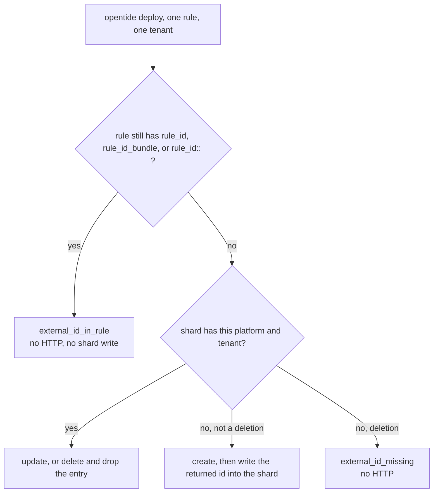

# RFC 0008: Deployment external ids

- **RFC:** 0008
- **Title:** Deployment external ids
- **Author:** Behemoth Security
- **Status:** proposed
- **Created:** 2026-09-30
- **Issue:** [#30](https://github.com/OpenTideHQ/specifications/issues/30)
- **Implementation:** [opentide#396](https://github.com/OpenTideHQ/opentide/issues/396)
- **Deferred:** inflight moves to `.opentide/states/inflight/` in [#31](https://github.com/OpenTideHQ/specifications/issues/31). This RFC does not move it.

> Numbering note: [issue #8](https://github.com/OpenTideHQ/specifications/issues/8) reserved **RFC 0004** for the Sysdig Falco deployer. That RFC file is not in this repository yet. This proposal takes **0008**.

## Summary

Vendor-assigned rule ids leave the rule file and move to `.opentide/states/deployment/<metadata.uuid>.json`. Each shard is the map from that rule to the external id of each tenant, for the platforms that assign an id OpenTide does not choose: Microsoft Defender for Endpoint, SentinelOne, and CrowdStrike. Deploy reads and writes the shard. It no longer splices `rule_id::<tenant>:` into the rule YAML.

`rule_id`, `rule_id_bundle`, and every `rule_id::<tenant>` key come off the platform blocks that carry them today, including the HarfangLab and Carbon Black fields deploy never reads. Platform schema ids stay `platform::<identifier>::1.0`. `rule::1.0` stays `rule::1.0`. A rule that still contains those keys is invalid, and deploy refuses it before any HTTP call.

**Catalogues that already have those keys must migrate, and the migration has to land in git, or the next deploy creates a second live rule.** Defender, SentinelOne, and CrowdStrike do not address the remote rule by `metadata.uuid`. The YAML line is the only copy of the id. There is no compatibility read that keeps using the rule file once this lands.

## Motivation

Deploy has to update a Defender custom detection, a SentinelOne STAR rule, or a CrowdStrike correlation rule on the id the vendor returned at create time. The id is per tenant: the same Tide rule deployed to two tenants has two ids. Nothing in the detection content is that id.

The implementation stores it on the rule and writes it back by splicing a line into the YAML. That has five consequences.

1. **The rule file is deployment state.** A create dirties a file authors treat as content. The diff mixes a vendor id with the detection change that triggered the deploy.
2. **The spelling deploy writes is illegal at validation.** Deploy writes `rule_id::<tenant>:`. Static validation does not run the loader that folds that alias, so the key is unknown and `opentide validate` fails the file deploy just wrote. The map forms `rule_id` and `rule_id_bundle` are the spellings validation accepts, and they are not the spelling the writer emits.
3. **Sharing publishes the id.** [RFC 0005](0005-sharing-system.md) carries the rule document verbatim. A `rule_id::<tenant>` line and a `rule_id_bundle` map travel to MISP with the rule. The id is an address on a tenant, not intelligence.
4. **The splice is brittle.** It matches a whole line, inserts four spaces regardless of indent, and on delete removes a line only when the text matches exactly, including the id's rendering. A map-form id, a different indent, or a doubled space survives a deletion and the next deploy updates or fails against a stale binding.
5. **Two platforms accept a field they ignore.** HarfangLab addresses Sigma and YARA rules by `metadata.uuid`. Carbon Black addresses the IOC by `metadata.uuid` and the report by title. Both still take `rule_id_bundle`, so the block looks like it reconciles an id.

Sharing already established `.opentide/states/` as the place for generated synchronization state (`.opentide/states/sharing.jsonl`). Deployment is the subsystem [specs/sharing.md](../specs/sharing.md) said would get its own state there. The record is one shard per rule, because the binding is per rule and per tenant, and because this record is not a cache.

Stakeholders:

- **Detection engineers** with Defender, SentinelOne, or CrowdStrike rules already in production. Their ids have to move, once, in a commit that contains both the stripped YAML and the new shards.
- **Catalogue reviewers** who currently see vendor ids in rule diffs, and who share rules outward.
- **Implementers (opentide)** who maintain three copies of the same write-back (Defender inline, SentinelOne and CrowdStrike through `ExternalIdHelper`) and a loader alias that exists to undo it.

## Research

Observed in opentide at `d01f8c16616ac477786203209fcc27b60a826b01`. This is what the shard replaces. It is not a behaviour to preserve past the migration.

### Who assigns the id

| Platform | How the next deploy finds the remote rule | Where the id lives today |
|----------|--------------------------------------------|--------------------------|
| `defender_for_endpoint` | Graph beta `id` from `POST /security/rules/detectionRules`. The client stores `int(response["id"])`. Update is `PATCH .../detectionRules/{id}`. Delete expects HTTP 204. | `configurations.defender_for_endpoint.rule_id`, a `dict[str, int]` keyed by tenant name. The writer emits `rule_id::<tenant>:`. |
| `sentinel_one` | STAR rule id returned by `create_update_detection_rule` (int). | `rule_id_bundle: dict[str, int]`. The writer emits `rule_id::<tenant>:`. |
| `crowdstrike` | `resources[0].id` from the create response (string). | `rule_id_bundle: dict[str, str]`. The writer emits `rule_id::<tenant>:`. |
| `sentinel` | Analytics rule id is `metadata.uuid` (`create_or_update` / `delete` `rule_id=`). | Nowhere. Nothing is written back. |
| `harfanglab` | Sigma id and YARA meta id are `metadata.uuid`. | `rule_id_bundle` is loaded and never read. |
| `carbon_black_cloud` | IOC id is `metadata.uuid`. The report is matched by title. | `rule_id_bundle` is loaded and never read. |
| `splunk` | Saved search. No vendor id in the block. | No field. |
| `elastic` ([RFC 0007](0007-elastic-security-platform.md), accepted, spec not yet a file) | Kibana `rule_id` is set to `metadata.uuid`. Kibana's internal `id` is never stored. | No write-back. This RFC does not change that decision. |

Tenant names are the map keys. SentinelOne and CrowdStrike look up `tenant_config.name.strip()`. Defender looks up the tenant name it was given. The written line uses that same string inside `rule_id::<tenant>:`.

### The two writers

SentinelOne and CrowdStrike call `ExternalIdHelper` in `src/opentide/deployment/utils.py`.

Insert, after the line whose text with one trailing colon removed equals the platform identifier (`sentinel_one`, `crowdstrike`):

```python
updated.append(f"    rule_id::{tenant_name}: {rule_id}\n")
```

The indent is four spaces, not the indent of the platform key. Remove deletes a line only when its stripped text is exactly `rule_id::{tenant_name}: {rule_id}`.

Defender does not use that helper. `defender_for_endpoint/deployer.py` duplicates it. Insert matches the line `defender_for_endpoint:` and appends `    rule_id::{tenant}: {rule_id}`. Delete matches `rule_id::{tenant}: {rule_id}`. On create the comment in the log is "write back the ID to the file".

A missing id on `DELETION` does not call the vendor. The deployer logs that the rule has to be removed by hand. That failure mode stays: without an id there is nothing to delete. The difference is where a present id is read from.

### The loader alias

`src/opentide/loading/platform_loader.py`:

- `_external_rule_id` returns `rule_id_bundle` immediately when that key is present, and otherwise folds every `rule_id::<tenant>` key into a dict. SentinelOne, CrowdStrike, HarfangLab, and Carbon Black use it.
- Defender folds `rule_id::<tenant>` first. It reads the `rule_id` map only when that fold is empty.

So the file deploy writes is the alias, and the file validation accepts is the map. [specs/platforms/index.md](../specs/platforms/index.md) already says a raw `rule_id::<tenant>` key fails `opentide validate`. Production rules that have been deployed carry the key validation rejects.

### Gitignore

`opentide setup` writes `.opentide/states/` as a single gitignore line (`src/opentide/cli/services/setup/repo.py`, `_write_gitignore`). That matches [specs/sharing.md](../specs/sharing.md): `sharing.jsonl` is a regenerable cache, and deleting it only turns a later `unchanged` into `updated`, because the connector finds the MISP Event by organisation plus object uuid.

A deployment shard is not that kind of file. Deleting it, or never committing it, drops the only Defender, SentinelOne, or CrowdStrike id. The next deploy creates a new remote rule beside the old one. `DELETION` then cannot see the original. The scaffold ignore has to narrow to `sharing.jsonl` before any shard is written.

### Inflight

CI writes `.opentide/inflight/<uuid>.json` (`inflight.shard::1.0`). Setup creates that directory and does not gitignore it. Moving it to `.opentide/states/inflight/` is [#31](https://github.com/OpenTideHQ/specifications/issues/31), after this RFC, so the git policy for `.opentide/states/` is settled before a third occupant arrives. This RFC does not change the inflight path, the shard schema, or the `generate inflight` jobs.

### Sysdig

[Issue #8](https://github.com/OpenTideHQ/specifications/issues/8) drafts a `rule_id_bundle` on `configurations.sysdig`, described as the same per-tenant map. RFC 0004 is still reserved and has no file here. When that RFC is written, a Sysdig-assigned id goes in the deployment shard. It does not go on the block.

## Detailed design

### 1. The shard

| Path | What it is | Committed? |
|------|------------|------------|
| `.opentide/states/sharing.jsonl` | Sharing cache. Unchanged. | No. Implementations SHOULD gitignore this file. |
| `.opentide/states/deployment/<uuid>.json` | Vendor id for one rule. | **Yes.** Implementations MUST NOT gitignore this directory. |
| `.opentide/inflight/<uuid>.json` | Preview overlay. Unchanged by this RFC. | Unchanged. |

`<uuid>` is `metadata.uuid` in lowercase canonical form. One file per rule that has at least one stored external id. A rule that has never been deployed to Defender, SentinelOne, or CrowdStrike has no file. Deploying that rule to Sentinel, Splunk, HarfangLab, Carbon Black, or Elastic does not create one.

The file is UTF-8 JSON, two-space indent, one trailing newline. Object keys are sorted at every level so a rewrite of one tenant does not reshuffle the others.

```json
{
  "object_uuid": "00000000-0000-4000-8003-000000000010",
  "platforms": {
    "crowdstrike": {
      "falcon-prod": "c5e1b2a0e4c84f0a9d3b7e6a1c8f0d22"
    },
    "defender_for_endpoint": {
      "contoso": "12345",
      "fabrikam": "67890"
    },
    "sentinel_one": {
      "s1-prod": "4242"
    }
  },
  "schema": "deployment.state::1.0"
}
```

| Field | Required | Meaning |
|-------|----------|---------|
| `schema` | yes | The string `deployment.state::1.0`. |
| `object_uuid` | yes | Canonical UUID. MUST equal the filename stem. A mismatch fails the rule with `deployment_state_uuid_mismatch` and deploy does not create a remote rule. |
| `platforms` | yes | Map of platform identifier to a map of tenant name to external id. Empty `platforms` is not written; the file is removed instead. |

The tenant name is the platform tenant `name`, with surrounding whitespace stripped. Lookup strips the same way. One binding per pair of platform and tenant. The external id is a JSON string, never a JSON number.

| Platform | `external_id` |
|----------|----------------|
| `defender_for_endpoint` | Canonical decimal integer, no sign and no leading zeroes (`12345`). This is the Graph detection-rule `id` the client stores with `int()`. |
| `sentinel_one` | Canonical decimal integer. The STAR rule id. |
| `crowdstrike` | The create-response id, verbatim. It is not parsed as an integer. |

A later platform that needs a vendor id is added to this table. It does not gain a field on its block. A platform key other than the three in the table fails `deployment_state_platform`.

Root keys other than the three above are preserved when a writer rewrites the file, so a newer field can survive an older CLI. Inside a platform object every key is a tenant name and every value is a string. A non-string tenant value fails `deployment_state_shape`.

Writers are `opentide deploy` and `opentide deploy migrate-state`. A hand edit is possible and the next deploy overwrites the tenant entry it touches. Other tenants and other platforms in the same file stay as they were. A writer MUST read the file, change one tenant entry, and write the rest back. Create writes the entry only after the vendor returns an id. A failed create writes nothing. A successful delete removes that tenant entry, then the platform key when it has no tenants, then the file when `platforms` is empty.

### 2. Schema changes

No new `metadata.schema`. No new `platform::<identifier>::1.1`. The platform schema id stays on the existing `::1.0` spec file. The break is that the keys below become unknown keys.

Minting `::1.1` would make every rule change its `schema:` line on top of the id migration. The identifier is already not a closed enum (legacy values such as `defender_for_endpoint::2.3` still validate). A new id would not tell an old file what to do with `rule_id::Contoso`. Removing the key does.

`rule::1.0` is unchanged. `configurations` stays a map of platform blocks.

#### Keys removed

| Platform | Spec | Removed from the block | After acceptance |
|----------|------|------------------------|------------------|
| `defender_for_endpoint` | [defender-for-endpoint-1.0.md](../specs/platforms/defender-for-endpoint-1.0.md) | `rule_id` (`map[string, int]`) and the loader alias `rule_id::<tenant>` | Create, update, and delete use the shard. |
| `sentinel_one` | [sentinel-one-1.0.md](../specs/platforms/sentinel-one-1.0.md) | `rule_id_bundle` (`map[string, int]`) and `rule_id::<tenant>` | Same. The requirement that bundle values are integers moves to the shard string pattern. |
| `crowdstrike` | [crowdstrike-1.0.md](../specs/platforms/crowdstrike-1.0.md) | `rule_id_bundle` (`map[string, string]`) and `rule_id::<tenant>` | Same. |
| `harfanglab` | [harfanglab-1.0.md](../specs/platforms/harfanglab-1.0.md) | `rule_id_bundle` and `rule_id::<tenant>` | Still addressed by `metadata.uuid`. The unused field is gone. Migration does not copy it into a shard. |
| `carbon_black_cloud` | [carbon-black-cloud-1.0.md](../specs/platforms/carbon-black-cloud-1.0.md) | `rule_id_bundle` and `rule_id::<tenant>` | IOC id remains `metadata.uuid`. Report match remains the title. The unused field is gone. Migration does not copy it into a shard. |

#### Keys that stay

| Platform | Identity after this RFC |
|----------|-------------------------|
| `sentinel` | `metadata.uuid` is the analytics rule id. No shard entry. |
| `splunk` | Saved search. No shard entry. |
| `harfanglab` | `metadata.uuid` on the Sigma rule and the YARA meta id. No shard entry. |
| `carbon_black_cloud` | `metadata.uuid` on the IOC; report title on the report. No shard entry. |
| `elastic` | [RFC 0007](0007-elastic-security-platform.md): Kibana `rule_id` is `metadata.uuid`; the internal id is not stored. No shard entry. |

#### Edits inside each platform spec

Acceptance edits the `::1.0` files in place and adds a history row. The field row, the requirement that names the field, and the deploy sentences that read or write it all go.

`defender-for-endpoint-1.0.md`:

- Summary no longer says the id is stored on the block.
- The requirement that `rule_id` may be omitted goes away with the field.
- The deploy table's `DELETION` row requires a shard entry for the tenant. With no entry, deploy reports `external_id_missing` and does not call delete.
- The deploy table's create/update row reads the shard. A create writes the returned id into the shard. It does not write the rule file.

`sentinel-one-1.0.md` and `crowdstrike-1.0.md`: the same replacement of `rule_id_bundle` with the shard, including the `DELETION` row.

`harfanglab-1.0.md` and `carbon-black-cloud-1.0.md`: delete the field row and the requirements that say the bundle may be present and is not read. Deploy behaviour is otherwise the same text.

[platforms/index.md](../specs/platforms/index.md): replace [External rule ids](../specs/platforms/index.md#external-rule-ids) with a short table of who stores a vendor id and a pointer at the deployment-state spec. The sentence that says loaders fold `rule_id::<tenant>` before the unknown-key check goes away with the alias. The Splunk loader aliases and the Defender `quarantine_files` alias stay.

[workspace.md](../specs/workspace.md): add the path to the `.opentide/` table and the example tree. State that `.opentide/states/deployment/` is generated and committed, and that `.opentide/states/sharing.jsonl` stays a gitignored cache. The inflight section stays on `.opentide/inflight/`.

[sharing.md](../specs/sharing.md): the sentence that a later subsystem gets its own file under `.opentide/states/` becomes: sharing keeps one ledger file; deployment state is the directory of shards defined here; a further subsystem names its own path and whether that path is a cache or a record. Sharing's ledger fields are unchanged.

[deployment.md](../specs/deployment.md): one paragraph. `DELETION` and update for Defender, SentinelOne, and CrowdStrike require the shard entry. Strategies themselves do not change.

[validation.md](../specs/validation.md): `schema` validation rejects the removed keys with `external_id_in_rule`. A present shard is checked for shape. A missing shard is not an error.

New [specs/deployment-state.md](../specs/deployment-state.md), `schema_id: deployment.state::1.0`, holding the shard table, the git rule, the migrate command, and the deploy read/write rules. `schemas/deployment.state.1.0.schema.json` is the JSON Schema for the shard, on the same footing as `schemas/inflight.shard.1.0.schema.json`: a checker artifact, not a second normative source.

`SPECS.md`, `CHANGELOG.md`, and `llms.txt` gain the new spec when it lands. They are not part of this proposal's diff beyond indexing the RFC.

#### Fixtures

| Fixture | Expectation |
|---------|-------------|
| `fixtures/deployment/valid/<uuid>.json` | One shard with all three platforms, sorted keys, string ids, integer ids in canonical decimal. |
| `fixtures/deployment/invalid/` | One file per failure the checker can see: bad `schema`, filename / `object_uuid` mismatch, JSON number instead of string, leading-zero Defender id, empty external id. |
| Existing `fixtures/platforms/*.yaml` | Stay valid. None of them carry `rule_id` or `rule_id_bundle` today. |
| A rule fixture with `rule_id::Tenant` or `rule_id_bundle` | Fails `external_id_in_rule`. Lives under `fixtures/deployment/invalid/` so the object checker, which does not walk platform blocks, is not the thing that has to learn the code. |
| Shard whose `platforms` names `sentinel` | Fails `deployment_state_platform`. |

No vocabulary change. No change under `specs/objects/` or `schemas/pins/`.

### 3. Existing rules must migrate

This section is the upgrade. A catalogue that skips it and deploys with the new CLI does not "keep working".

Defender, SentinelOne, and CrowdStrike will not look up a remote rule by `metadata.uuid`, by display name, or by walking the tenant and guessing. The id written into the rule on the last create is the only handle. After the keys are illegal, that handle exists only in the shard. A deploy with neither the key nor the shard **creates a new remote rule** and leaves the previous one in place, still firing. `DELETION` of the original then reports `external_id_missing`, because the id was thrown away.

There is no dual-read. Deploy does not open the rule looking for `rule_id`, `rule_id_bundle`, or `rule_id::<tenant>`. If any of those keys is present, on any platform block, deploy fails that rule with `external_id_in_rule` **before any HTTP call**, whether or not a shard entry also exists. Validate fails the same rule with the same code. The only command that reads the old keys is the migration.



`DELETION` with no shard entry does not create. It reports `external_id_missing` and does not call the vendor, which is today's missing-id path.

#### What has to be migrated

On every platform block, at the block root only (not inside `query`, `exclusions`, `alert`, or any other nested key):

| Key | Shape today | Where it shows up |
|-----|-------------|-------------------|
| `rule_id::<tenant>` | scalar, int or string | The line deploy actually writes. Validation already rejects it. |
| `rule_id` | map of tenant name to int | Defender's model field. Validation accepts it. |
| `rule_id_bundle` | map of tenant name to int or string | SentinelOne, CrowdStrike, HarfangLab, Carbon Black. |

Both of these Defender shapes are the same binding and both have to move:

```yaml
configurations:
  defender_for_endpoint:
    rule_id::Contoso: 12345
    enabled: true
    schema: platform::defender_for_endpoint::1.0
    query: |
      DeviceProcessEvents
      | where FileName =~ "cmd.exe"
```

```yaml
configurations:
  defender_for_endpoint:
    rule_id:
      Contoso: 12345
      Fabrikam: 67890
```

SentinelOne and CrowdStrike use `rule_id_bundle` or the same `rule_id::<tenant>` line. CrowdStrike values may be strings.

#### The command

`opentide deploy migrate-state` does the move. It does not call a vendor API and it does not deploy.

1. **Refuse a gitignored destination.** If a `.gitignore` in the workspace excludes `.opentide/states/` or `.opentide/states/deployment/`, the command exits `1` with `deployment_state_ignored` and **does not edit any rule**. The message names the ignore line and the replacement: ignore `.opentide/states/sharing.jsonl` only. Setup today writes the directory ignore, and it does not rewrite an existing `.gitignore`, so every existing workspace hits this until someone changes that line. The command does not edit `.gitignore` itself.
2. **Scan rule files.** Every `.yaml` and `.yml` file under the configured rule directory, recursively, including files in subfolders that deploy itself skips. An id in a nested file still has to move.
3. **Collect bindings** from the three keys above.
4. **Write the shard first**, for Defender, SentinelOne, and CrowdStrike only, and make that write durable before the YAML changes. A crash after the shard write and before the YAML edit leaves both copies. The next run sees that they agree and strips the YAML.
5. **Then remove the keys from the YAML** without rewriting the rest of the document. Comments, key order, and unrelated whitespace stay. The migration deletes the external-id lines and the `rule_id` / `rule_id_bundle` mapping blocks. It does not round-trip the file through a parser that drops comments.
6. **Leave a conflict untouched.** The same tenant mapped twice, or mapped to a different id than the shard already holds, is `external_id_conflict` for that rule. That rule's YAML and that rule's shard are not modified. Other rules still migrate. The command exits `1`.
7. **Drop unused bundles loudly.** A HarfangLab or Carbon Black `rule_id_bundle` or `rule_id::<tenant>` is removed from the YAML and is **not** written to a shard. Those deployers never read the value; copying it into the shard would pretend it is a live address. Each discarded binding is printed (`external_id_unused`: platform, tenant, value) before the YAML is edited. The value remains in git history of the rule file.
8. **A clean second run is a success.** No legacy keys, shards already in place, exit `0`.

A value that is not a scalar string or int, a `rule_id` / `rule_id_bundle` that is not a mapping, an empty tenant name, an empty id, or a Defender or SentinelOne value that is not a canonical decimal integer fails that rule with `external_id_shape` and leaves it untouched.

Integer scalars are stored as canonical decimal strings. `12345` and `"12345"` become `"12345"`. A string with a leading zero fails `external_id_shape` on Defender and SentinelOne rather than being rewritten to a different integer. CrowdStrike strings are copied verbatim.

#### The commit

The migration is not finished when the command exits `0`. It is finished when the default branch contains, in the same commit:

- every rule with the legacy keys removed, and
- every new or updated file under `.opentide/states/deployment/`, and
- a `.gitignore` that does not exclude that directory.

A commit that strips the YAML and forgets the shards, or a shard directory that git never sees, is the duplicate-rule failure. `opentide deploy` MUST refuse to **create** a remote rule when the deployment-state directory is gitignored (`deployment_state_ignored`), including when the ignore is the existing `.opentide/states/` line. An update or delete that can read an existing shard file still runs, and warns, so a tree that already has the files is not stuck while gitignore is fixed.

If the shard write fails after the vendor has created a rule, deploy reports `deployment_state_write_failed` and includes the id in that error. It does not delete the remote rule to roll the create back.

#### Worked example

Before, a file deploy has already spliced:

```yaml
configurations:
  defender_for_endpoint:
    rule_id::Contoso: 12345
    enabled: true
    schema: platform::defender_for_endpoint::1.0
    status: PRODUCTION
    query: |
      DeviceProcessEvents
      | where FileName =~ "cmd.exe"
```

After `migrate-state`, that line is gone and the rest of the file is unchanged. The new file `.opentide/states/deployment/00000000-0000-4000-8003-000000000010.json` holds:

```json
{
  "object_uuid": "00000000-0000-4000-8003-000000000010",
  "platforms": {
    "defender_for_endpoint": {
      "Contoso": "12345"
    }
  },
  "schema": "deployment.state::1.0"
}
```

The next deploy to tenant `Contoso` patches detection rule `12345`. It does not post a second rule. A deploy that runs on a checkout where this JSON is absent, and where the YAML line is already gone, posts a second rule.

### 4. Git policy

| Path | Policy |
|------|--------|
| `.opentide/states/sharing.jsonl` | SHOULD be gitignored. Cache. |
| `.opentide/states/deployment/` | MUST be committed. MUST NOT be gitignored. |
| `.opentide/inflight/` | Unchanged until [#31](https://github.com/OpenTideHQ/specifications/issues/31). |

`opentide setup` MUST stop writing `.opentide/states/` as an ignore rule. The ignore it writes for a new repository is `.opentide/states/sharing.jsonl`. Setup does not rewrite an existing `.gitignore`; `migrate-state` is what stops an old ignore from hiding the shards.

### 5. What deploy does with the shard

For Defender, SentinelOne, and CrowdStrike, per tenant the deployment plan already selected:

| Legacy key on the rule | Shard entry | Result |
|------------------------|-------------|--------|
| present | present or absent | `external_id_in_rule`. No HTTP. |
| absent | present | Update, or delete and remove the entry. |
| absent | absent, strategy is not `DELETION` | Create. Write the returned id into the shard. |
| absent | absent, strategy is `DELETION` | `external_id_missing`. No HTTP. |

Disablement is an update that sets the vendor's disabled state, using the shard id. It does not remove the entry.

The shard is the record of what OpenTide created. It is not rebuilt by listing the tenant's rules and matching titles. A title match is how a renamed rule, or two rules with one name, would update the wrong remote object.

## Drawbacks

- **The shard is a second file, and losing it duplicates production rules.** That is the cost of taking the id out of the only file people already commit. The migration command, the gitignore refusal, and the fail-closed deploy exist because of it.
- **Every deployed Defender, SentinelOne, and CrowdStrike rule needs a one-time commit.** Rules that only target Sentinel, Splunk, HarfangLab, Carbon Black, or Elastic have nothing to move.
- **Unused HarfangLab and Carbon Black bundles are deleted, not stored.** They were not addresses. Recovery is the git history of the rule file, plus the `external_id_unused` lines the command prints.
- **The tenant name is the key.** Renaming a tenant in `platforms/<id>.toml` orphans the entry. The next deploy creates a new remote rule under the new name. The old id remains in the shard under the old name until something removes it.
- **Two creates that both see no shard can still double-create.** The same race exists today between two writers splicing the YAML. This RFC does not add a lock across machines.
- **Keeping `platform::*::1.0` means the schema id does not advertise the break.** The history row on each platform spec and the validation failure `external_id_in_rule` are what a catalogue sees. A reader who only checks `schema:` will think nothing changed.
- **Committed shards still contain tenant names and vendor ids.** They no longer sit inside the document `opentide share` publishes. Tenant names that authors wrote in `tenants` or in exclusions still do.

## Alternatives

- **Keep the write-back on the rule.** The id stays beside the detection, validate keeps rejecting the line deploy writes, and sharing keeps publishing tenant addresses.
- **One JSONL ledger, on the sharing model.** Sharing's ledger is a cache keyed by object, connector, and target, and it is safe to delete. A deployment id is a record keyed by rule and tenant. One file per rule is what a reviewer diffs when a single rule is deployed. A ledger also fights the per-uuid shard the inflight work already uses.
- **Rediscover the id by listing remote rules and matching the display name.** Defender's display name is the Tide rule `name`, which is not unique, and a rename would retarget a different rule. A wrong match is worse than a duplicate.
- **Dual-read: shard if present, otherwise the YAML.** A catalogue can then skip the migration forever, and the day someone deletes the YAML keys, deploy creates duplicates. Fail-closed is the migration.
- **New `platform::*::1.1` spec files that omit the field.** Every rule would also change `schema:`. The identifier is not a closed enum, so the new id does not force the key off old files. The key has to become illegal on `::1.0`.
- **Store integer ids as JSON numbers.** CrowdStrike ids are strings, and one field type keeps the shard uniform. The integer constraint is a pattern on the string.
- **A bare directory outside `.opentide/states/` so the current gitignore can stay.** The states directory is the place sharing defined for this. The gitignore is what changes. It was written when that directory held only a cache.
- **Gitignore the shards and keep them on the deploy runner.** A clean CI checkout would create a second rule on every run.
- **Move inflight in this RFC.** [#31](https://github.com/OpenTideHQ/specifications/issues/31) does that later. Mixing the path move with the id migration puts two unrelated catalogue changes in one upgrade.

## Unresolved questions

| # | Question | Leaning |
|---|----------|---------|
| 1 | Should the generated deploy workflow commit shard updates, given that today's write-back lands in the rule file and is committed by whoever commits the rule? | The spec requires the shard to be committed. It does not add a bot commit. Opentide's CI templates can do that in the implementation issue if a workflow already commits deploy output. |
| 2 | Should a command delete shards whose `object_uuid` is no longer in the registry? | Leave them. The file is the handle for a rule that was removed from the tree while the remote rule still exists. |
| 3 | Is a tenant rename worth an alias list on the shard? | Not in this revision. A rename is a new key. |
| 4 | Carbon Black's report id, and Splunk's saved-search name, are unstable across a rename and are not stored. If a later change needs them, do they join this shard? | Yes. They join the platform table in §1. They do not go back onto the block. |

## References

- Spec-change issue: [specifications#30](https://github.com/OpenTideHQ/specifications/issues/30)
- Inflight path, deferred: [specifications#31](https://github.com/OpenTideHQ/specifications/issues/31)
- opentide implementation: [opentide#396](https://github.com/OpenTideHQ/opentide/issues/396)
- Current normative text this replaces on acceptance: [specs/platforms/index.md](../specs/platforms/index.md#external-rule-ids), [defender-for-endpoint-1.0.md](../specs/platforms/defender-for-endpoint-1.0.md), [sentinel-one-1.0.md](../specs/platforms/sentinel-one-1.0.md), [crowdstrike-1.0.md](../specs/platforms/crowdstrike-1.0.md), [harfanglab-1.0.md](../specs/platforms/harfanglab-1.0.md), [carbon-black-cloud-1.0.md](../specs/platforms/carbon-black-cloud-1.0.md)
- State directory this extends: [specs/sharing.md](../specs/sharing.md), [specs/workspace.md](../specs/workspace.md), [RFC 0005](0005-sharing-system.md)
- Elastic identity, unchanged: [RFC 0007](0007-elastic-security-platform.md)
- Sysdig draft that must not grow another `rule_id_bundle`: [specifications#8](https://github.com/OpenTideHQ/specifications/issues/8)
- opentide writers and loader: `src/opentide/deployment/utils.py` (`ExternalIdHelper`), `src/opentide/platforms/defender_for_endpoint/deployer.py`, `src/opentide/platforms/sentinel_one/deployer.py`, `src/opentide/platforms/crowdstrike/deployer.py`, `src/opentide/loading/platform_loader.py`, `src/opentide/cli/services/setup/repo.py`
- Governance: [GOVERNANCE.md](../GOVERNANCE.md), [RFC 0001](0001-authority-model.md)
